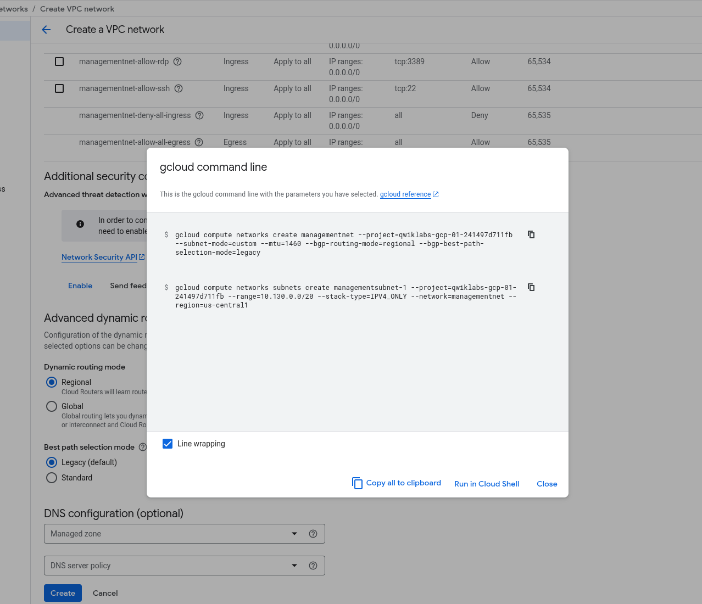

# ☁️ Reporte de Laboratorio: Redes de VPC Múltiples y Multi-NIC

**Laboratorio:** GSP211 - Multiple VPC Networks

**Plataforma:** Google Cloud Platform (Qwiklabs)

**Estado:** Completado (100/100) ✅

**Fecha:** 19 de Noviembre, 2025

## 🎯 1. Objetivo del Laboratorio

El objetivo principal fue salir de la red "default" y aprender a construir infraestructuras de red aisladas y personalizadas. Específicamente:

1. Crear **VPCs en modo personalizado** (Custom Mode) para tener control total de los rangos IP.

2. Configurar reglas de **Firewall** para permitir tráfico administrativo (SSH, RDP, ICMP).

3. Desplegar una **VM con Múltiples Interfaces de Red (Multi-NIC)**, actuando como un puente entre tres redes distintas.

## 🛠️ 2. Desarrollo y Construcción

### Fase A: Creación de Redes VPC (GUI vs. CLI)

Comenzamos creando la red `managementnet`. A diferencia de la red `default` (que crea subredes en todo el mundo), usamos el **Modo Personalizado** para definir manualmente la región y el rango IP (`10.130.0.0/20`).

- **¿Por qué Custom Mode?** Para evitar superposiciones de IP (IP Overlapping) y tener una topología de red limpia, esencial para entornos de producción.

📸 Evidencia de Configuración GUI:

Aquí se muestra la configuración manual de la subred en la consola web.

Posteriormente, para la segunda red (`privatenet`), utilicé `gcloud` en Cloud Shell. Esto demostró cómo la **Infraestructura como Código** es más rápida que hacer clics en la consola.

📸 Evidencia de Creación vía CLI:

Creación de la VPC y subredes usando comandos.

📸 Verificación de Redes:

Listado final de las redes creadas (managementnet, privatenet y mynetwork).

### Fase B: Seguridad y Firewalls 🛡️

Las redes en GCP son cerradas por defecto (Implicit Deny). Para poder administrar las máquinas, tuve que crear reglas de firewall permitiendo:

- **tcp:22** (SSH para Linux)

- **tcp:3389** (RDP para Windows)

- **icmp** (Ping para pruebas de conectividad)

Una característica interesante de la consola es que nos permite ver el **"Comando equivalente"**. Esto es muy útil para aprender la sintaxis de `gcloud` sin memorizarla.

📸 Herramienta de Aprendizaje:

La consola mostrando el código equivalente a la configuración visual.

📸 Aplicación de Reglas:

Ejecución del comando para abrir los puertos en privatenet.

### Fase C: Despliegue de Instancias y Multi-NIC 🐙

El paso final fue crear las máquinas virtuales. La estrella del show fue `vm-appliance`.

- **Configuración Especial:** Esta VM se configuró con **3 interfaces de red (nic0, nic1, nic2)**.

- **Propósito:** Tener presencia simultánea en tres redes aisladas (`privatenet`, `managementnet`, `mynetwork`).

📸 Estado Final de las Instancias (CLI):

Aquí verificamos que todas las máquinas estuvieran en estado RUNNING.

📸 Panel de Control (GUI):

Vista consolidada con las IPs internas y externas asignadas. Se aprecia claramente que vm-appliance tiene múltiples IPs.

## ⚠️ 3. Desafíos y Solución de Problemas (Troubleshooting)

Durante el laboratorio, enfrenté dos obstáculos técnicos importantes que sirvieron como experiencia de aprendizaje:

### 1. Error de Sintaxis en Firewall 🚫

- **Problema:** Al crear la regla de firewall, ingresé los puertos separados por un punto (`22. 3389`) en lugar de una coma.

- **Solución:** La consola de GCP es estricta con el formato. Se corrigió a `22, 3389` y se agregó explícitamente el protocolo `icmp` en la sección de "Otros protocolos".

### 2. Fallo de Autenticación SSH 🔑

- **Problema:** Error `Permission denied (publickey)` al intentar conectar a `mynet-vm-1`.

- **Diagnóstico:** A pesar de que la infraestructura estaba correcta (score 100/100), el agente de la VM (Google Guest Agent) no sincronizó correctamente las llaves SSH temporales del laboratorio debido a tiempos de arranque.

- **Impacto:** No se pudieron realizar los pings manuales desde dentro de la terminal, pero se verificó la conectividad teórica mediante la configuración de rutas y NICs.

## 🧠 4. Conclusiones Técnicas

Este laboratorio demostró cómo funcionan las **rutas** en un entorno multi-interfaz:

1. Aunque la `vm-appliance` tiene 3 patas, el tráfico saliente por defecto siempre intenta usar la puerta de enlace de la interfaz primaria (`eth0`).

2. Por eso, los pings a redes lejanas fallan a menos que se configure **Policy Routing** dentro del sistema operativo Linux.

3. La arquitectura de VPCs personalizadas es la base para cualquier entorno de producción seguro en Google Cloud.

