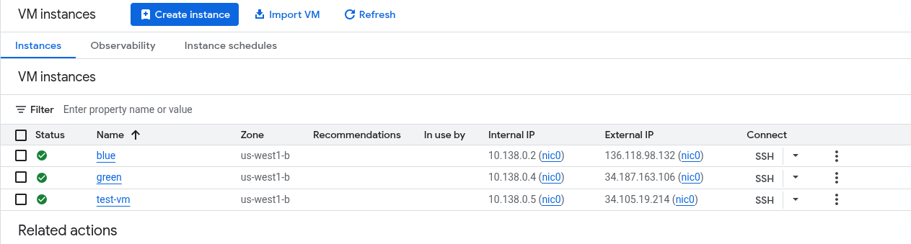

# Informe de Laboratorio: Redes de VPC - Cómo controlar el acceso (GSP213)

## 1. Descripción General y Objetivos

En este laboratorio, exploramos cómo proteger y segmentar el tráfico en una red de Google Cloud (VPC). El objetivo principal fue entender cómo las **etiquetas de red (network tags)** funcionan junto con las **reglas de firewall** para permitir o denegar tráfico a instancias específicas sin afectar a otras en la misma red. Además, se analizaron los roles de IAM para gestionar quién puede modificar estas reglas de seguridad.

**Conceptos Clave:**

- **VPC (Virtual Private Cloud):** Nuestra red privada en la nube.

- **Reglas de Firewall:** "Porteros" que deciden qué tráfico entra o sale.

- **Etiquetas de Red:** Identificadores que pegamos a las máquinas virtuales (VMs) para aplicarles reglas específicas.

- **IAM (Identity and Access Management):** Control de permisos para usuarios o máquinas.

## 2. Tarea 1: Creación de Servidores Web (Blue y Green)

### ¿Qué hicimos?

Creamos dos máquinas virtuales (VM) idénticas en especificaciones, pero con una diferencia crucial en su configuración de red para demostrar el aislamiento selectivo.

1. **Servidor `blue`:** Se le asignó la etiqueta de red `web-server`.

2. **Servidor `green`:** No se le asignó ninguna etiqueta.

### ¿Para qué sirve?

Esto simula un entorno real donde, por ejemplo, quieres que tu servidor web sea accesible desde internet (público), pero tu base de datos o servidor de backend permanezca oculto, aunque ambos estén en la misma subred.

### Comandos Utilizados

Para instalar el servidor web Nginx y personalizar la página de bienvenida, nos conectamos por SSH y ejecutamos:

```
# Instalar Nginx
sudo apt-get install nginx-light -y

# Editar el mensaje de bienvenida para diferenciar los servidores
sudo nano /var/www/html/index.nginx-debian.html
# Se cambió el texto a: "Welcome to the blue server!" o "green server!"
```

### Evidencia

A continuación, se muestra el estado final de las instancias. Se puede observar que `blue` y `green` están corriendo, junto con la máquina de pruebas `test-vm`.



## 3. Tarea 2: Configuración del Firewall

### ¿Qué hicimos?

Creamos una regla de firewall llamada `allow-http-web-server` que permite tráfico **TCP** en el puerto **80** (HTTP) desde cualquier origen (`0.0.0.0/0`).

**La clave:** Esta regla se aplicó **solo** a las instancias con la etiqueta de destino `web-server`.

### ¿Para qué sirve?

Esto ilustra el principio de **mínimo privilegio** en redes. En lugar de abrir el puerto 80 para toda la red (lo cual expondría al servidor `green` innecesariamente), solo lo abrimos para los servidores que realmente sirven páginas web (`blue`).

### Comandos de Verificación

Creamos una instancia `test-vm` y usamos `curl` para probar la conectividad.

```
# Prueba interna (Funciona en ambos porque están en la misma VPC)
curl [IP_INTERNA_BLUE]  # Éxito
curl [IP_INTERNA_GREEN] # Éxito

# Prueba externa (Simulando un usuario en internet)
curl [IP_EXTERNA_BLUE]  # Éxito (Gracias a la regla de firewall + etiqueta)
curl [IP_EXTERNA_GREEN] # Falla (Time out - No tiene la etiqueta, el firewall lo bloquea)
```

### Evidencia

Aquí se observa la regla de firewall creada, apuntando específicamente a la etiqueta `web-server`.


<!--

INSTRUCCIÓN: Coloca aquí la imagen:

"2025-11-19 22.56.50 console.cloud.google.com 90105cce70c8.png"

Descripción: Muestra la lista de reglas de Firewall, destacando 'allow-http-web-server'.

-->

## 4. Tarea 3: Gestión de Accesos (IAM)

### ¿Qué hicimos?

Exploramos la diferencia entre dos roles importantes:

1. **Administrador de Red (Network Admin):** Puede ver y editar la estructura de la red, pero **NO** puede tocar las reglas de firewall (seguridad).

2. **Administrador de Seguridad (Security Admin):** Tiene el poder de crear y borrar reglas de firewall.

Creamos una cuenta de servicio (`Network-admin`), generamos unas credenciales JSON y las usamos dentro de `test-vm` para intentar borrar la regla de firewall.

### Comandos Utilizados

```
# Autenticarse con la cuenta de servicio limitada
gcloud auth activate-service-account --key-file credentials.json

# Intento 1: Borrar regla siendo 'Network Admin'
gcloud compute firewall-rules delete allow-http-web-server
# Resultado: PERMISSION DENIED (Correcto, es seguro).

# Intento 2: Borrar regla tras cambiar el rol a 'Security Admin'
gcloud compute firewall-rules delete allow-http-web-server
# Resultado: DELETED (Correcto, ahora tiene permisos).
```

### Evidencia

La siguiente imagen muestra la cuenta de servicio creada para estas pruebas.


<!--

INSTRUCCIÓN: Coloca aquí la imagen:

"2025-11-19 22.56.07 console.cloud.google.com b259d5c1403a.png"

Descripción: Muestra la lista de Cuentas de Servicio.

-->

## 5. Conclusión

Este laboratorio demostró exitosamente cómo Google Cloud permite una gestión granular de la seguridad.

1. Aprendimos que **no basta con tener una IP pública** para ser accesible; el firewall es la barrera final.

2. Usamos **etiquetas** para aplicar reglas de seguridad de manera escalable (si creamos 100 servidores "blue", solo hay que ponerles la etiqueta y heredarán la regla).

3. Verificamos que los **permisos de IAM** son críticos: separar quién diseña la red de quién gestiona la seguridad es una buena práctica empresarial.
