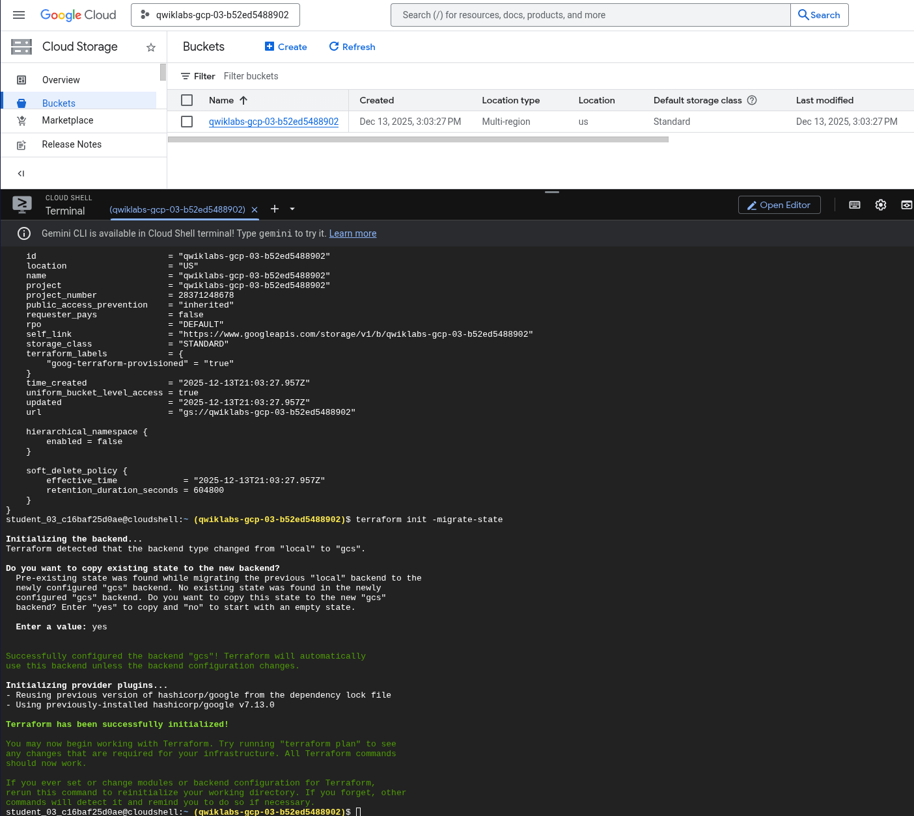
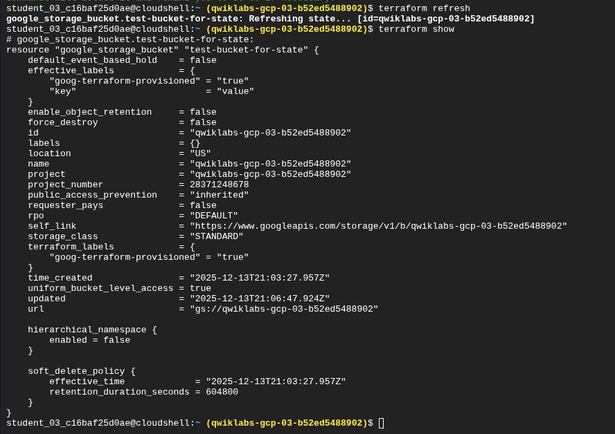
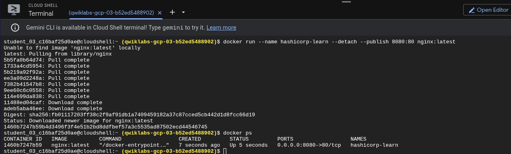
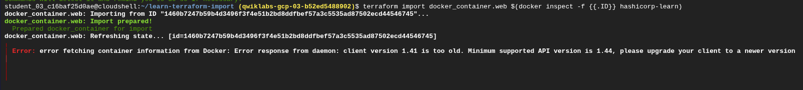
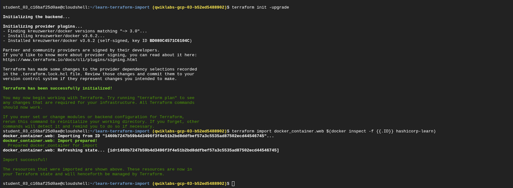
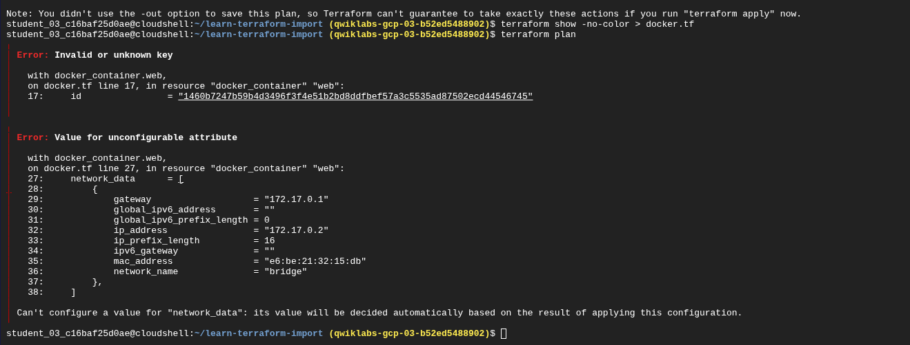
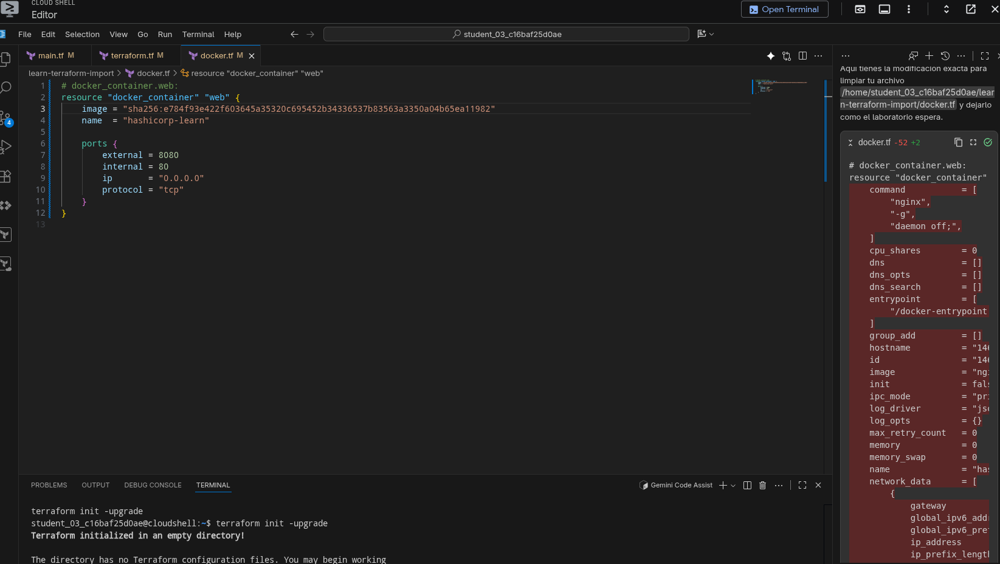
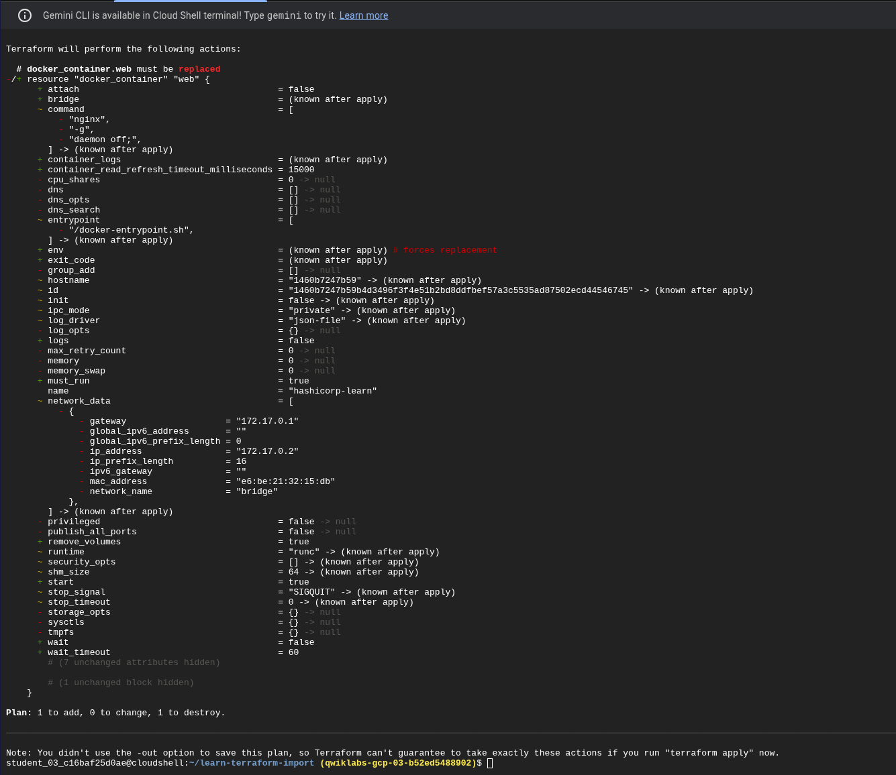
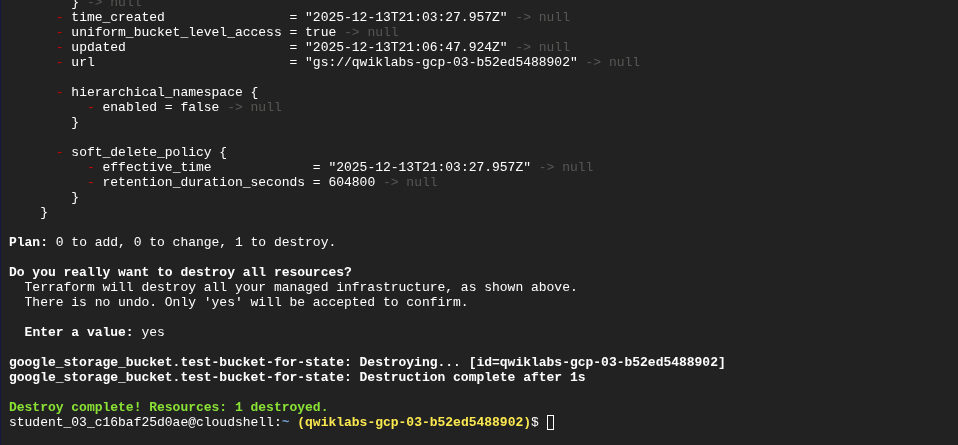

# Reporte de Laboratorio: Gestión de Estado e Importación con Terraform (GSP752)

Autor: Christhian Rodriguez

Fecha: 13 de Diciembre, 2025

Tema: Terraform State Management, Backends Remotos & Importación de Infraestructura Legacy.

## 1. Introducción

En este laboratorio avanzado, nos alejamos del despliegue básico para enfrentar dos escenarios críticos en la ingeniería de nube real:

1. **Gestión de Estado (Backend):** Mover el archivo de estado (`terraform.tfstate`) de local a un almacenamiento remoto seguro (GCS) para permitir colaboración y bloqueo de estado.

2. **Importación y "Brownfield":** Tomar control de infraestructura existente ("legacy") creada manualmente fuera de Terraform, enfrentando y resolviendo conflictos de versiones de API en el proceso.

## 2. Tarea 1: Gestión del Estado (Backend Remoto)

El objetivo inicial fue asegurar el archivo de estado. Por defecto, Terraform guarda el estado localmente, lo cual es inseguro y no escala en equipos.

### 2.1 Migración a Google Cloud Storage (GCS)

Configuramos un bloque `backend "gcs"` en nuestro archivo `main.tf` y ejecutamos la migración. Esto sube el estado al bucket, habilitando el **State Locking** (para prevenir escrituras simultáneas) y la encriptación en reposo.

> 
> 
> **Evidencia de Migración:** Ejecución de `terraform init -migrate-state`. Terraform detecta el cambio de backend local a remoto y solicita confirmación ("yes") para transferir el estado existente sin pérdida de datos.

### 2.2 Detección de Cambios Fuera de Banda (Drift)

Para probar la robustez del estado, realizamos cambios manuales en la consola de Google Cloud (agregando etiquetas al bucket) que no estaban en el código. Utilizamos `terraform refresh` para reconciliar la realidad con el estado.

> 
> 
> **Drift Management:** El comando `terraform show` revela `effective_labels`. Aquí se observa cómo Terraform detectó la etiqueta `key = "value"` que fue agregada manualmente, demostrando la discrepancia entre la configuración declarada y la infraestructura real.

## 3. Tarea 2: Importación y Troubleshooting (Caso de Estudio)

Esta sección documenta el desafío técnico de importar un contenedor Docker "legacy" bajo el control de Terraform. Esta tarea presentó un problema de **incompatibilidad de versiones (Version Drift)** que requirió un diagnóstico y corrección manual.

### 3.1 El Escenario "Legacy"

Creamos un contenedor Nginx manualmente usando comandos de Docker, simulando un recurso existente que necesitaba ser gestionado por código.

> 
> 
> **Infraestructura Pre-existente:** Creación manual del contenedor `hashicorp-learn` mediante CLI, operando fuera del control de Terraform.

### 3.2 El Conflicto de Versiones (Diagnóstico)

Al intentar importar el recurso con `terraform import`, la operación falló.

**El Problema:** El entorno de Cloud Shell utiliza una versión moderna del motor Docker (API 1.44), mientras que la configuración predeterminada del laboratorio utilizaba una versión antigua del proveedor de Terraform (diseñada para API 1.41).

> 
> 
> **Error Crítico:** El mensaje `client version 1.41 is too old` indica una ruptura en la comunicación entre el proveedor y el host. Este es un ejemplo clásico de "Supply Chain Version Drift".

### 3.3 La Solución: Actualización de Dependencias

Para resolverlo, no bastaba con reintentar. Fue necesario intervenir el archivo de configuración del proveedor para permitir versiones más recientes.

1. **Acción:** Modificamos la restricción de versión en el bloque `required_providers`.

2. **Ejecución:** Corrimos `terraform init -upgrade` para forzar la descarga de binarios compatibles.

> 
> 
> **Resolución:** Ajuste en el archivo `terraform.tf`, cambiando la versión estricta a `~> 3.0`, permitiendo a Terraform negociar una versión compatible con la API del host.

### 3.4 Importación y Limpieza de Código (Refactoring)

Una vez resuelta la conexión, la importación fue exitosa, pero el código generado automáticamente contenía "ruido" (atributos de solo lectura) que impedían la ejecución del plan.

> 
> 
> **Validación de Código:** Terraform rechaza atributos como `network_data` o `gateway` en el archivo `.tf` porque son valores computados por Docker, no configurables por el usuario.

Procedimos a limpiar el archivo `docker.tf`, eliminando los identificadores hardcodeados (SHA256) y los atributos de solo lectura, dejando una configuración limpia y declarativa.

> 
> 
> **Refactorización:** Eliminación de líneas innecesarias (bloque rojo) para alinear el código con las mejores prácticas de IaC.

### 3.5 Resultado Final: Inmutabilidad

Al aplicar la configuración final (cambiando puertos o referencias de imagen), Terraform demostró el principio de inmutabilidad: en lugar de modificar el contenedor en vivo, planeó su reemplazo.

> 
> 
> **Éxito:** El plan muestra `must be replaced`. Esto confirma que Terraform ha tomado control total del ciclo de vida del recurso, gestionando su destrucción y recreación de manera controlada.

## 4. Limpieza de Recursos

Finalmente, como buena práctica de ingeniería y costos, destruimos toda la infraestructura provisionada.

> 
> 
> **Cierre:** Ejecución de `terraform destroy` confirmando la eliminación de los recursos gestionados.

## 5. Lecciones Aprendidas

1. **State Management:** El uso de backends remotos (GCS) es obligatorio para entornos productivos para garantizar consistencia y seguridad.

2. **Troubleshooting de Versiones:** Los errores de API entre Terraform y los proveedores son comunes. La solución requiere entender la cadena de dependencias y saber usar `init -upgrade`.

3. **Importar no es Mágico:** `terraform import` solo trae el estado. Es responsabilidad del ingeniero generar, limpiar y refactorizar el código (`.tf`) para que sea funcional y mantenible.
