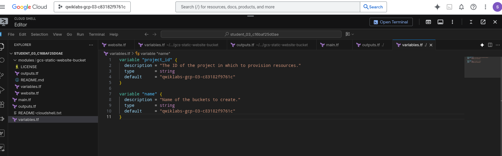
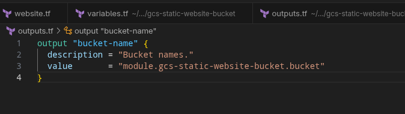
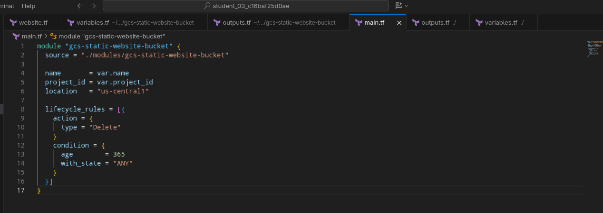
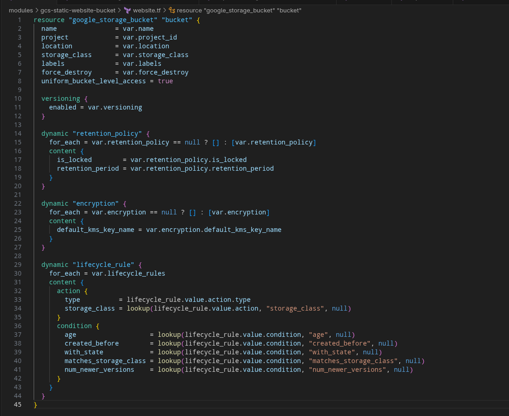
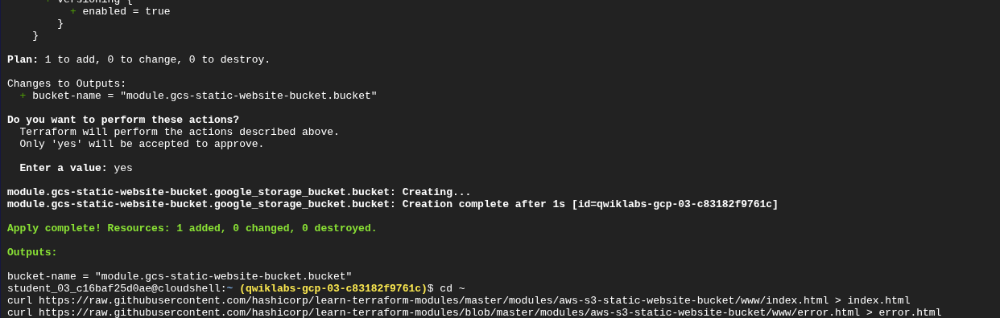
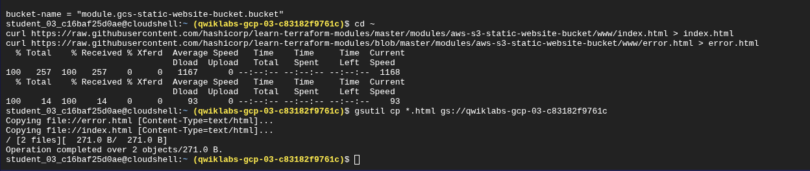
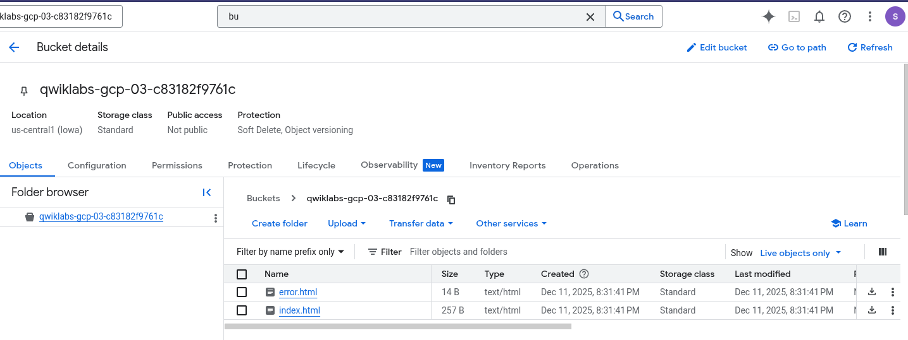
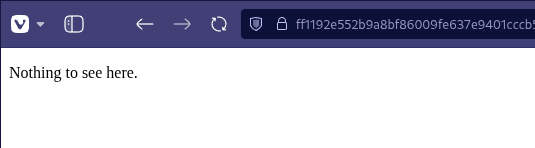

# Reporte de Laboratorio: Interactuando con Módulos de Terraform (GSP751)

Autor: Christhian Rodriguez

Fecha: 12 de Diciembre, 2025

Tema: Modularización de Infraestructura como Código (IaC)

## 1. Introducción

El objetivo de este laboratorio fue transicionar de escribir configuraciones de Terraform monolíticas (un solo archivo gigante) a una arquitectura **modular**. Aprendimos a consumir módulos públicos del Registry de Terraform y, más importante aún, a construir nuestros propios módulos locales para encapsular la lógica, reutilizar código y mejorar la seguridad.

## 2. Tarea 1: Uso de Módulos del Registry

En la primera parte, no escribimos el código desde cero, sino que "alquilamos" una receta ya hecha.

- **Acción:** Clonamos el repositorio `terraform-google-network`.

- **Concepto:** Usamos el bloque `module` apuntando a una fuente externa (`source`) y definimos variables específicas para nuestro entorno (Red y Subredes).

- **Resultado:** Se desplegó una VPC completa sin tener que definir cada recurso de red manualmente.

## 3. Tarea 2: Construcción de un Módulo Personalizado (Bucket Estático)

Esta fue la sección principal del laboratorio. Creamos una estructura de archivos que separa la lógica del recurso (el módulo) de la configuración del usuario (la raíz).

### 3.1 Estructura del Proyecto

Organizamos el directorio para separar "La Cocina" (el módulo) del "Mostrador" (la raíz).

- **Raíz (`~/`):** `main.tf`, `variables.tf`, `outputs.tf`.

- **Módulo (`~/modules/gcs...`):** `website.tf`, `variables.tf`, `outputs.tf`, `LICENSE`.

> 
> 
> **Evidencia de Estructura:** En la siguiente imagen se aprecia el árbol de directorios a la izquierda, mostrando la carpeta `modules` y los archivos raíz.

### 3.2 Definición del Módulo ("La Cocina")

Dentro de la carpeta `modules/gcs-static-website-bucket`, creamos el archivo `website.tf`. Este archivo contiene el recurso `google_storage_bucket` y utiliza variables internas para configurar sus propiedades dinámicamente.

> 
> 
> **Código del Recurso:** Aquí vemos la definición del recurso con bloques dinámicos para el ciclo de vida y la retención.

### 3.3 Configuración Raíz ("El Mostrador")

En el directorio raíz, editamos el `main.tf` para **llamar** al módulo que acabamos de crear. Pasamos los valores específicos (como el `project_id`) desde la raíz hacia el módulo.

> 
> 
> **Llamada al Módulo:** El bloque `module` en la raíz apuntando a `./modules/gcs-static-website-bucket`.

También definimos un `output` en la raíz para que Terraform nos muestre el nombre del bucket al finalizar. Esto conecta la salida del módulo con la consola del usuario.

> 
> 
> **Output Raíz:**

### 3.4 Despliegue (Terraform Apply)

Ejecutamos `terraform init` para registrar el módulo local y `terraform apply` para crear la infraestructura.

> 
> 
> **El Plan de Ejecución:** Terraform detecta que debe crear un recurso `google_storage_bucket` dentro del módulo.

> 
> 
> **Confirmación y Creación:** Confirmamos con "yes" y obtenemos el nombre del bucket en los Outputs verdes.

### 3.5 Carga de Contenido y Verificación

Descargamos archivos HTML de ejemplo y los subimos al bucket usando `gsutil`.

> 
> 
> **Subida de Archivos:** Usando `gsutil cp` para mover el `index.html` a la nube.

Verificamos en la Consola de Google Cloud que el bucket existe y contiene los archivos.

> 
> 
> **Verificación en GUI:** El bucket `qwiklabs-gcp...` con los archivos cargados.

Finalmente, accedemos a la URL pública para ver el sitio estático funcionando.

> 
> 
> **Sitio Web en Vivo:**

### 3.6 Limpieza

Como buena práctica, destruimos la infraestructura al terminar.

> **Terraform Destroy:**
> 
> 

## 4. Zona de Aprendizaje: Análisis y Conceptos Clave

Esta sección resume las discusiones técnicas mantenidas durante el laboratorio para consolidar el conocimiento.

### 4.1 La Analogía de la Panadería (Modularización)

Entendimos que usar módulos es como operar una franquicia de panaderías:

- **El Módulo (La Cocina):** Es donde están las reglas, las recetas (`resources`) y los procesos internos. Es código genérico y reutilizable.

- **La Raíz (El Mostrador):** Es donde se hacen los pedidos. No se cocina aquí, solo se pasan parámetros (`variables`) a la cocina.

- **Beneficio:** Si necesitas 10 buckets, no construyes 10 cocinas. Haces 10 pedidos al mismo módulo.

### 4.2 El Flujo de Datos (La Tubería)

Aprendimos por qué parece que "duplicamos" variables. Terraform no conecta mágicamente la raíz con el módulo.

- **Input:** Usuario -> `variables.tf` (Raíz) -> `main.tf` (Llamada) -> `variables.tf` (Módulo) -> Recurso.

- **Output:** Recurso -> `outputs.tf` (Módulo) -> `outputs.tf` (Raíz) -> Consola del Usuario.

### 4.3 Seguridad: Lo que se comparte y lo que se oculta

Discutimos la importancia crítica de no exponer datos sensibles al subir código a repositorios como GitHub (Git).

| **Archivo / Carpeta**                   | **¿Subir al Repo?** | **Razón**                                                                |
| --------------------------------------- | ------------------- | ------------------------------------------------------------------------ |
| `main.tf`, `variables.tf`, `outputs.tf` | SÍ                  | Es la estructura y lógica del código (la receta).                        |
| `LICENSE`, `README.md`                  | SÍ                  | Documentación y permisos legales para usuarios.                          |
| **`terraform.tfstate`**                 | **NO**              | **Peligro Crítico.** Contiene contraseñas y datos reales en texto plano. |
| **`*.tfvars`**                          | **NO**              | Contiene tus valores secretos (API keys, passwords).                     |
| **`.terraform/`**                       | **NO**              | Son binarios y plugins pesados específicos de tu PC.                     |

**Conclusión:** Un buen ingeniero de DevOps siempre incluye un archivo `.gitignore` configurado para bloquear el estado y las variables sensibles antes de hacer un commit.
