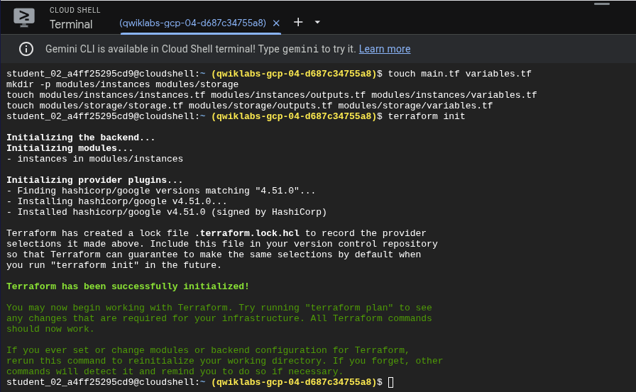
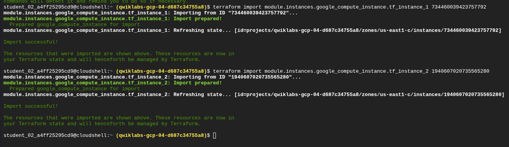
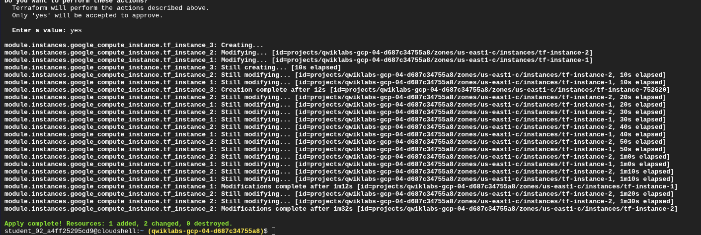
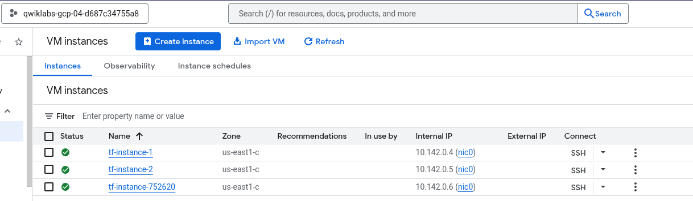
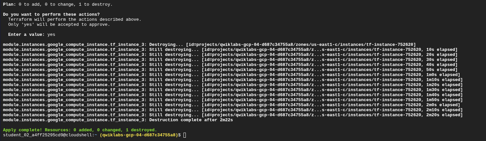
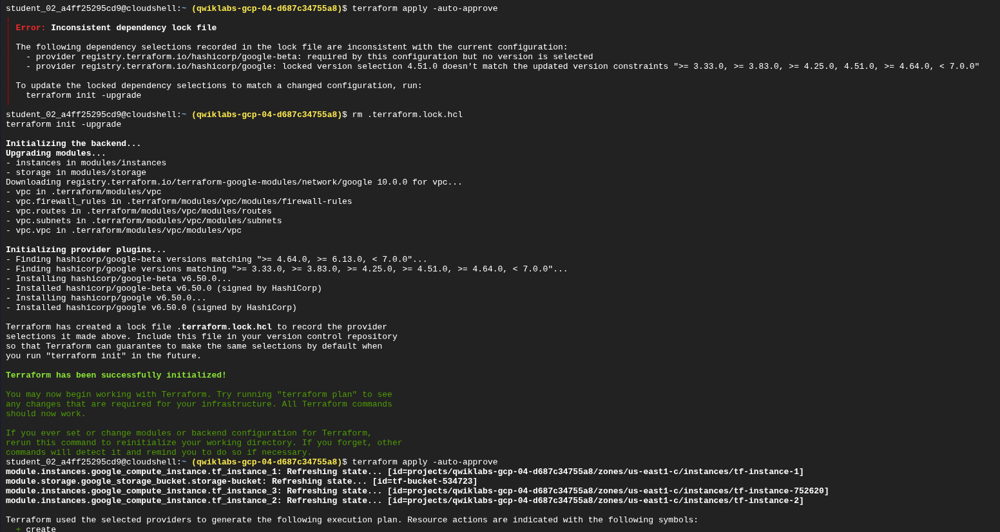
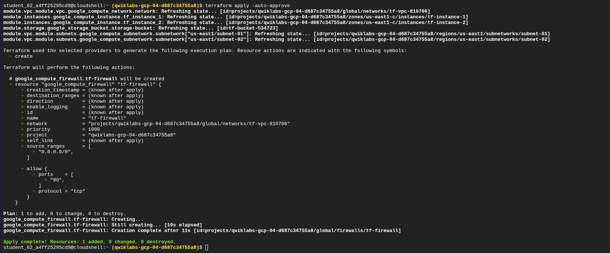
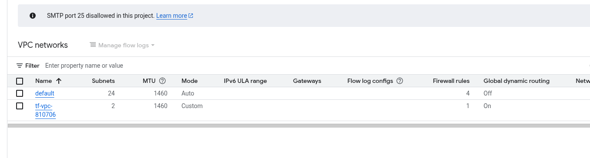
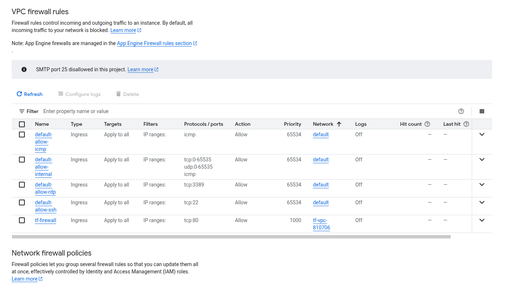

# Reporte de Laboratorio: Desafío de Terraform en Google Cloud (GSP345)

Autor: Christhian Rodriguez

Fecha: 14 de Diciembre, 2025

Tema: Infraestructura como Código, Importación de Recursos, Módulos de Registro y Troubleshooting Avanzado.

## 1. Introducción

En este laboratorio de desafío ("Challenge Lab"), el objetivo fue demostrar la competencia en Terraform para construir, importar y gestionar infraestructura en Google Cloud bajo un escenario semi-realista sin instrucciones paso a paso.

El proyecto abarcó el ciclo de vida completo de la infraestructura:

1. **Inicialización:** Configuración de un entorno modular.

2. **Importación:** Toma de control de recursos "legacy" (creados manualmente).

3. **Gestión de Estado:** Migración a un backend remoto seguro.

4. **Redes y Seguridad:** Implementación de VPC modular y Firewalls.

5. **Troubleshooting:** Resolución de conflictos de versiones de proveedores y condiciones de carrera (race conditions).

## 2. Tarea 1: Inicialización e Importación de Infraestructura

El primer reto consistió en tomar control de dos instancias de Compute Engine (`tf-instance-1` y `tf-instance-2`) que ya existían en el proyecto pero no estaban gestionadas por Terraform.

### 2.1 Configuración del Entorno (Scaffolding)

Se creó la estructura de directorios modular (`instances`, `storage`) y se definieron los archivos de configuración iniciales, estableciendo las variables de región y zona.

> 
> 
> **Fig 1. Scaffolding:** Inicialización del proyecto con `terraform init` y creación de la estructura de archivos (`main.tf`, `variables.tf`, módulos).

### 2.2 Importación de Estado (State Import)

Utilizando ingeniería inversa, escribimos el código `instances.tf` para coincidir con la configuración real (`e2-micro`, `debian-11`). Usamos el comando `terraform import` para vincular los IDs de las instancias reales con nuestro código local.

> 
> 
> **Fig 2. Importación:** Ejecución exitosa de `terraform import`, transfiriendo la gestión de las instancias al estado de Terraform (`Import successful!`).

*Nota:* Al agregar el script de inicio (`metadata_startup_script`), Terraform detectó correctamente que debía recrear las instancias para aplicar este cambio estructural, asegurando la inmutabilidad de la infraestructura.

## 3. Tarea 2: Backend Remoto y Modificación de Recursos

Para asegurar el estado, creamos un bucket de Cloud Storage y configuramos el bloque `backend "gcs"`, migrando el estado local (`terraform.tfstate`) a la nube para permitir colaboración y bloqueo de estado.

### 3.1 Escalado Vertical y Horizontal

Se modificó el tipo de máquina de las instancias existentes a `e2-standard-2` (escalado vertical) y se agregó una tercera instancia `tf-instance-752620` (escalado horizontal).

> 
> 
> **Fig 3. Ejecución de Cambios:** Terraform aplica cambios "in-place" para actualizar las instancias existentes y crea la tercera nueva.

> 
> 
> **Fig 4. Verificación:** Las tres instancias corriendo correctamente con la nueva configuración en la consola de Compute Engine.

### 3.2 Ciclo de Vida (Destrucción Controlada)

Siguiendo los requerimientos del desafío, eliminamos la tercera instancia mediante código para verificar la capacidad de limpieza de recursos y gestión de costos.

> 
> 
> **Fig 5. Destroy:** Eliminación controlada de la tercera instancia (`1 to destroy`), confirmando el control total del ciclo de vida.

## 4. Tarea 3: Redes y Troubleshooting (Análisis de Incidentes)

Esta sección presentó la mayor complejidad técnica. Se requería implementar una VPC personalizada usando un módulo del Terraform Registry y configurar un Firewall. Durante este proceso, enfrentamos y resolvimos dos incidentes críticos.

### 4.1 Incidente 1: Conflicto de Dependencias (Dependency Hell)

Al intentar usar el módulo de red `terraform-google-modules/network/google` versión `10.0.0`, la inicialización falló.

- **Síntoma:** Error `Inconsistent dependency lock file`.

- **Causa Raíz:** El archivo `main.tf` original bloqueaba el proveedor `google` a la versión `4.51.0`, pero el módulo de red moderno requería una versión superior (`>= 6.0`).

- **Resolución:** Se eliminó el archivo de bloqueo con `rm .terraform.lock.hcl` y se forzó la actualización de proveedores con `terraform init -upgrade`.

> 
> 
> **Fig 6. Diagnóstico y Solución:** Captura del error de bloqueo y la ejecución de los comandos de remediación en la terminal.

### 4.2 Incidente 2: Condición de Carrera (Race Condition)

Al aplicar la configuración de red y firewall simultáneamente, ocurrió un error `404 Not Found` al crear la regla de firewall.

- **Causa Raíz:** Terraform intentó crear el recurso `google_compute_firewall` antes de que el módulo de VPC terminara de aprovisionar la red `tf-vpc-810706`. Aunque Terraform paraleliza operaciones, no detectó esta dependencia implícita a través del módulo.

- **Resolución:** Se agregó explícitamente el meta-argumento `depends_on = [module.vpc]` en el recurso del firewall para forzar el orden de creación secuencial.

> 
> 
> **Fig 7. Despliegue Final:** Ejecución exitosa creando el Firewall (`1 to add`) después de asegurar que la red y las instancias ya estaban listas.

### 4.3 Resultado Final de Red

Las instancias fueron movidas exitosamente de la red `default` a la nueva red privada `tf-vpc-810706` con sus respectivas subredes.

> 
> 
> **Fig 8. Arquitectura de Red:** La VPC personalizada desplegada correctamente con modo de subred personalizado.

> 
> 
> **Fig 9. Seguridad:** La regla de firewall `tf-firewall` permitiendo tráfico TCP:80 y apuntando correctamente a la nueva red VPC.

## 5. Lecciones Aprendidas

1. **Gestión de Dependencias:** Los módulos externos del Registry evolucionan rápido. Es crítico gestionar el archivo `.terraform.lock.hcl` y entender cuándo usar `init -upgrade` para resolver conflictos entre versiones del proveedor y módulos.

2. **Orquestación de Recursos:** Terraform paraleliza la creación de recursos. Cuando existen dependencias que Terraform no detecta automáticamente (especialmente al mezclar recursos nativos con módulos complejos), el uso de `depends_on` es vital para evitar condiciones de carrera.

3. **Inmutabilidad vs Modificación:** Mover instancias de una red a otra implica recreación o reinicio de las mismas. Este comportamiento debe ser planificado en entornos productivos para evitar tiempos de inactividad no programados.

## 6. Anexo: Cheat Sheet de Comandos Utilizados

Referencia rápida de los comandos de CLI ejecutados durante el laboratorio y su propósito.

| **Comando**                     | **Propósito**                                                                                                   | **Contexto de Uso**                                                    |
| ------------------------------- | --------------------------------------------------------------------------------------------------------------- | ---------------------------------------------------------------------- |
| `terraform init`                | Inicializa el directorio de trabajo, descarga proveedores y configura el backend.                               | Primer paso obligatorio en cualquier proyecto.                         |
| `terraform init -upgrade`       | Fuerza la actualización de plugins y proveedores a las versiones más nuevas permitidas, ignorando el lock file. | Solución al error "Inconsistent dependency lock file".                 |
| `terraform import [addr] [id]`  | Vincula un recurso existente en la nube con un bloque de recurso en el código local.                            | Usado para traer `tf-instance-1` y `2` bajo control de Terraform.      |
| `terraform plan`                | Genera un plan de ejecución mostrando qué cambios se harán (dry-run).                                           | Verificación de seguridad antes de aplicar cambios.                    |
| `terraform apply`               | Aplica los cambios para alcanzar el estado deseado. Requiere confirmación `yes`.                                | Creación del bucket, VPC y modificación de instancias.                 |
| `terraform apply -auto-approve` | Aplica los cambios sin pedir confirmación manual.                                                               | Útil para iteraciones rápidas en entornos de prueba o pipelines CI/CD. |
| `terraform destroy`             | Destruye toda la infraestructura gestionada por la configuración.                                               | Usado implícitamente al remover la tercera instancia del código.       |
| `rm .terraform.lock.hcl`        | Elimina el archivo de bloqueo de dependencias.                                                                  | Maniobra de emergencia para resolver conflictos de versiones severos.  |

## 7. Análisis de Problemas: Laboratorio vs. Mundo Real

Comparativa de los desafíos enfrentados en este entorno controlado versus cómo se manifiestan en entornos de producción.

### 7.1 Problemas Comunes en Labs de Terraform

1. **Errores de Sintaxis HCL:** Olvidar comillas, llaves o referencias a variables (`var.zona` vs `"var.zona"`).

2. **IDs Incorrectos:** Copiar mal el ID del Proyecto o el ID de una instancia para el comando `import`.

3. **Versiones Hardcodeadas:** Los laboratorios antiguos suelen tener versiones de proveedores fijas (`4.51.0`) que rompen al usar módulos modernos.

4. **Resource Zombie:** Recursos que no se destruyen correctamente y bloquean la creación de nuevos recursos con el mismo nombre.

### 7.2 Desafíos Críticos en el Mundo Real

1. **State Locking en Equipos:** En un lab trabajas solo. En una empresa, si dos ingenieros ejecutan `apply` al mismo tiempo sin un Backend remoto (GCS/S3) con bloqueo configurado, pueden corromper el archivo de estado irreversiblemente.

2. **Drift de Configuración:** Alguien modifica un firewall manualmente "de emergencia" en la consola de GCP. Terraform no se enterará hasta el siguiente `plan`, donde intentará revertir ese cambio, potencialmente causando una interrupción.

3. **Dependency Hell en Módulos:** Actualizar un módulo centralizado de red puede romper la infraestructura de 50 equipos diferentes si no se usan versiones estrictas (`version = "1.2.3"`).

4. **Secret Management:** En los labs a veces ponemos credenciales o IDs en texto plano. En producción, esto es una vulnerabilidad grave; se deben usar herramientas como Vault o Google Secret Manager.

## 8. Conclusión

El laboratorio **GSP345 "Automating Infrastructure on Google Cloud with Terraform: Challenge Lab"** sirvió como una prueba integral de habilidades. Más allá de la simple provisión de recursos, el valor real de este ejercicio radicó en la resolución de problemas no guionados.

Lograr un puntaje de 100/100 requirió no solo conocimiento de la sintaxis HCL, sino una comprensión profunda de cómo Terraform gestiona las dependencias y el ciclo de vida de los recursos. La capacidad de diagnosticar un conflicto de versiones y mitigar una condición de carrera mediante `depends_on` son habilidades que distinguen a un operador básico de un Ingeniero de Nube competente. Este desafío valida la preparación práctica para certificaciones como la **Google Cloud Associate Cloud Engineer**.
