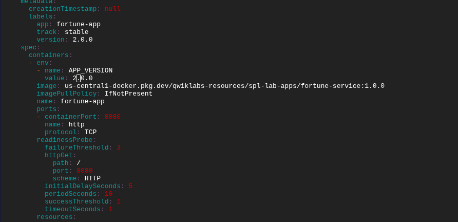
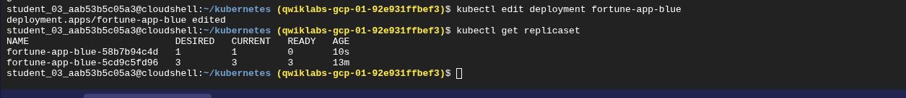
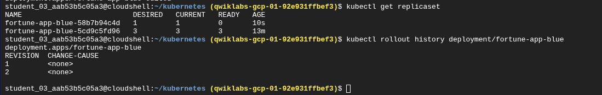
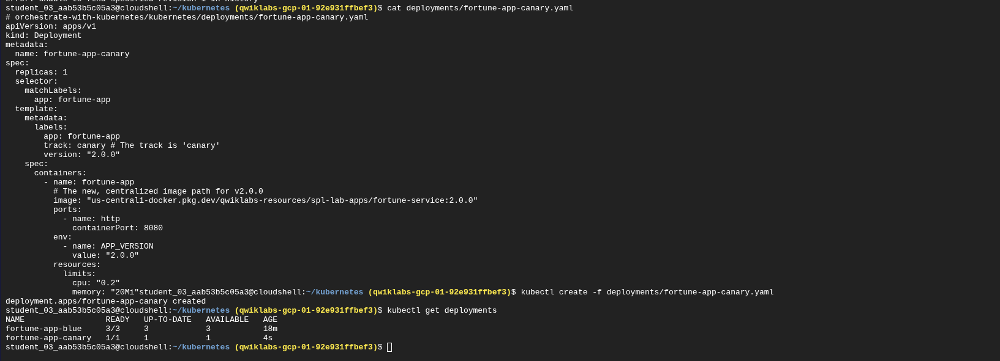
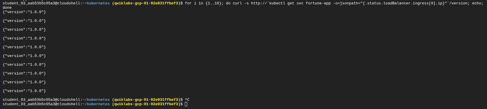
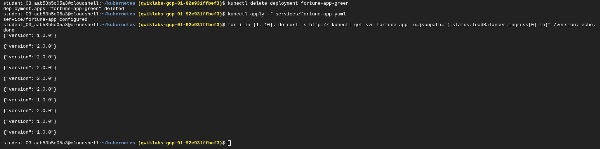

# Reporte de Laboratorio: Administración de Implementaciones con Google Kubernetes Engine

**Autor:** Christhian Alberto Rodriguez  
**Fecha:** 30 de Noviembre, 2025  
**Laboratorio:** GSP053 - Cómo administrar implementaciones con Kubernetes Engine  
**Duración:** 1 hora  
**Nivel:** Intermedio  

---

## Resumen Ejecutivo

Este laboratorio se enfocó en el dominio de estrategias avanzadas de implementación en Google Kubernetes Engine (GKE), incluyendo rolling updates, canary deployments, y blue-green deployments. Durante la práctica, se trabajó con múltiples versiones de una aplicación fortune-app, implementando diferentes patrones de despliegue que son fundamentales en entornos de producción para DevOps y CI/CD.

El laboratorio permitió adquirir experiencia práctica con kubectl, manifiestos YAML de Kubernetes, y técnicas de gestión de versiones que minimizan el riesgo en implementaciones de producción.

## Objetivos del Laboratorio

### Objetivos Primarios

- Dominar el uso de la herramienta `kubectl` para administración de clusters
- Crear y configurar archivos de implementación YAML 
- Iniciar, actualizar y escalar implementaciones de forma controlada
- Implementar patrones de actualización: rolling updates, canary deployments, y blue-green deployments
- Comprender las estrategias de rollback y recuperación ante fallos

### Objetivos Secundarios

- Aplicar conceptos de DevOps en un entorno real de nube
- Desarrollar habilidades de troubleshooting en Kubernetes
- Documentar procesos para portafolio profesional

## Entorno y Prerequisitos

### Infraestructura Utilizada

- **Plataforma:** Google Cloud Platform (GCP)
- **Servicio Principal:** Google Kubernetes Engine (GKE)
- **Región:** us-central1-c
- **Tipo de Máquinas:** e2-small
- **Número de Nodos:** 3
- **Imagen de Aplicación:** `us-central1-docker.pkg.dev/qwiklabs-resources/spl-lab-apps/fortune-service`

### Herramientas y Tecnologías

- `kubectl` - Cliente de línea de comandos de Kubernetes
- `gcloud` - CLI de Google Cloud Platform
- Cloud Shell - Entorno de desarrollo en la nube
- YAML - Formato de configuración de manifiestos
- Docker - Tecnología de contenedores

### Prerequisitos Técnicos

- Conocimientos básicos de contenedores Docker
- Familiaridad con conceptos de Kubernetes
- Comprensión de principios DevOps y CI/CD
- Experiencia básica con línea de comandos Linux

## Desarrollo del Laboratorio

### Fase 1: Configuración del Entorno

#### Creación del Cluster GKE

```bash
# Configuración de la zona de trabajo
gcloud config set compute/zone us-central1-c

# Obtención del código de muestra
gcloud storage cp -r gs://spls/gsp053/kubernetes .
cd kubernetes

# Creación del cluster con 3 nodos
gcloud container clusters create bootcamp \
  --machine-type e2-small \
  --num-nodes 3 \
  --scopes "https://www.googleapis.com/auth/projecthosting,storage-rw"
```

**Resultado:** Cluster `bootcamp` creado exitosamente con 3 nodos en estado `Running`.


<!-- IMAGEN 10: Insertar aquí la captura del GKE Console mostrando el cluster bootcamp activo con 3 nodos -->

<!-- Archivo: 2025-11-30_17_52_07_console_cloud_google_com_11b0d1d8e263.png -->

### Fase 2: Exploración del Objeto Deployment

#### Investigación de la Estructura Deployment

```bash
# Exploración básica del objeto Deployment
kubectl explain deployment

# Vista recursiva de todos los campos
kubectl explain deployment --recursive

# Análisis específico de metadatos
kubectl explain deployment.metadata.name
```

**Aprendizaje Clave:** Los objetos Deployment en Kubernetes encapsulan la configuración completa para gestionar conjuntos de Pods, incluyendo estrategias de actualización, escalado, y rollback.

### Fase 3: Implementación Base (Blue Deployment)

#### Creación del Deployment Principal

```bash
# Revisión del manifiesto
cat deployments/fortune-app-blue.yaml

# Creación de la implementación
kubectl create -f deployments/fortune-app-blue.yaml

# Verificación del deployment
kubectl get deployments
kubectl get replicasets
kubectl get pods
```

**Configuración del Manifiesto:**

```yaml
apiVersion: apps/v1
kind: Deployment
metadata:
  name: fortune-app-blue
spec:
  replicas: 3
  selector:
    matchLabels:
      app: fortune-app
  template:
    metadata:
      labels:
        app: fortune-app
        track: stable
        version: "1.0.0"
    spec:
      containers:
        - name: fortune-app
          image: "us-central1-docker.pkg.dev/qwiklabs-resources/spl-lab-apps/fortune-service:1.0.0"
          ports:
            - name: http
              containerPort: 8080
```

#### Exposición del Servicio

```bash
# Creación del servicio LoadBalancer
kubectl create -f services/fortune-app.yaml

# Verificación de la IP externa
kubectl get services fortune-app

# Prueba de conectividad
curl http://[EXTERNAL-IP]/version
```

**Resultado:** Servicio expuesto exitosamente con respuesta JSON: `{"version":"1.0.0"}`


<!-- IMAGEN 1: Insertar aquí la captura de terminal mostrando los comandos kubectl iniciales -->

<!-- Archivo: 2025-11-30_17_33_18_console_cloud_google_com_2d58316fa1a7.png -->

<!-- Muestra: kubectl get deployments, kubectl get replicasets, kubectl get pods, kubectl create service -->

### Fase 4: Escalado de Implementaciones

#### Escalado Horizontal

```bash
# Escalado a 5 réplicas
kubectl scale deployment fortune-app-blue --replicas=5

# Verificación del escalado
kubectl get pods | grep fortune-app-blue | wc -l

# Reducción a 3 réplicas
kubectl scale deployment fortune-app-blue --replicas=3
```

**Observación:** El escalado horizontal en Kubernetes es instantáneo y permite ajustar la capacidad según demanda sin tiempo de inactividad.


<!-- IMAGEN 2: Insertar aquí la captura de terminal mostrando comandos de escalado -->

<!-- Archivo: 2025-11-30_17_35_22_console_cloud_google_com_5ecde2abefab.png -->

<!-- Muestra: kubectl scale deployment, kubectl get pods con conteo de réplicas -->

### Fase 5: Rolling Updates (Actualizaciones Progresivas)

#### Actualización de Versión 1.0.0 a 2.0.0

```bash
# Edición en vivo del deployment
kubectl edit deployment fortune-app-blue
```

**Cambios realizados:**

- Imagen: `fortune-service:1.0.0` → `fortune-service:2.0.0`  
- Variable APP_VERSION: `"1.0.0"` → `"2.0.0"`
  
  
  
  

<!-- IMAGEN 3: Insertar aquí la captura del manifiesto YAML mostrando la versión 1.0.0 -->

<!-- Archivo: 2025-11-30_17_38_03_console_cloud_google_com_ac3efe48df87.png -->

<!-- Muestra: cat deployments/fortune-app-blue.yaml con imagen version 1.0.0 -->

<!-- IMAGEN 4: Insertar aquí la captura del manifiesto YAML mostrando la versión 2.0.0 -->

<!-- Archivo: 2025-11-30_17_39_59_console_cloud_google_com_4309b7602193.png -->

<!-- Muestra: cat deployments/fortune-app-blue.yaml con imagen version 2.0.0 editada -->

#### Gestión de Rolling Updates

```bash
# Monitoreo del ReplicaSet
kubectl get replicaset

# Verificación del historial
kubectl rollout history deployment/fortune-app-blue

# Pausa de la actualización
kubectl rollout pause deployment/fortune-app-blue

# Verificación del estado mixto
for p in $(kubectl get pods -l app=fortune-app -o=jsonpath='{.items[*].metadata.name}'); do 
  echo $p && curl -s http://$(kubectl get pod $p -o=jsonpath='{.status.podIP}')/version; echo; 
done

# Reanudación de la actualización
kubectl rollout resume deployment/fortune-app-blue

# Rollback a versión anterior
kubectl rollout undo deployment/fortune-app-blue
```

**Resultado:** Dominio completo del ciclo de vida de rolling updates, incluyendo pausa, reanudación y rollback.





<!-- IMAGEN 5: Insertar aquí la captura mostrando kubectl edit deployment y kubectl get replicaset -->

<!-- Archivo: 2025-11-30_17_42_03_console_cloud_google_com_02f019a4a016.png -->

<!-- Muestra: deployment.apps/fortune-app-blue edited, kubectl get replicaset con múltiples versiones -->

<!-- IMAGEN 6: Insertar aquí la captura del historial de rollout -->

<!-- Archivo: 2025-11-30_17_42_23_console_cloud_google_com_631ae1c52e30.png -->

<!-- Muestra: kubectl rollout history deployment/fortune-app-blue con revisiones -->

### Fase 6: Canary Deployments (Implementación Canario)

#### Problema Identificado y Resolución

**Situación:** Durante la implementación del canary deployment, se requería entender cómo distribuir el tráfico entre la versión estable (1.0.0) y la versión canary (2.0.0).

**Estrategia de Resolución:**

1. **Flota Principal (Blue):** 3 réplicas ejecutando v1.0.0
2. **Flota Canario (Canary):** 1 réplica ejecutando v2.0.0  
3. **División de Tráfico:** Aproximadamente 75% a v1.0.0 y 25% a v2.0.0

#### Implementación del Canary

```bash
# Creación del deployment canary
kubectl create -f deployments/fortune-app-canary.yaml

# Verificación de ambos deployments
kubectl get deployments

# Prueba de distribución de tráfico
for i in {1..10}; do 
  curl -s http://`kubectl get svc fortune-app -o=jsonpath="{.status.loadBalancer.ingress[0].ip}"`/version; 
  echo; 
done
```



<!-- IMAGEN 7: Insertar aquí la captura mostrando el manifiesto canary y la creación -->

<!-- Archivo: 2025-11-30_17_46_50_console_cloud_google_com_06622168d7e7.png -->

<!-- Muestra: cat deployments/fortune-app-canary.yaml, kubectl create, kubectl get deployments -->

**Resultado:** Distribución exitosa del tráfico con mayoría de peticiones dirigidas a v1.0.0 y un subconjunto a v2.0.0, permitiendo validación gradual de la nueva versión.



<!-- IMAGEN 8: Insertar aquí la captura del bucle curl mostrando la distribución de tráfico -->

<!-- Archivo: 2025-11-30_17_47_11_console_cloud_google_com_2884ffb61ad7.png -->

<!-- Muestra: for loop con curl repetido mostrando versiones 1.0.0 mezcladas con algunas 2.0.0 -->

### Fase 7: Blue-Green Deployments

#### Implementación Blue-Green

```bash
# Actualización del servicio a solo "blue"
kubectl apply -f services/fortune-app-blue-service.yaml

# Creación del deployment "green"
kubectl create -f deployments/fortune-app-green.yaml

# Switch completo a versión "green"
kubectl apply -f services/fortune-app-green-service.yaml

# Verificación de cambio inmediato
curl http://`kubectl get svc fortune-app -o=jsonpath="{.status.loadBalancer.ingress[0].ip}"`/version

# Rollback a versión "blue"
kubectl apply -f services/fortune-app-blue-service.yaml
```


<!-- IMAGEN 9: Insertar aquí la captura mostrando los comandos de blue-green deployment -->

<!-- Archivo: 2025-11-30_17_48_36_console_cloud_google_com_f31290dd4d1b.png -->

<!-- Muestra: kubectl apply services, kubectl create deployment green, curl commands -->

**Ventaja:** Cambio instantáneo entre versiones sin tiempo de inactividad y posibilidad de rollback inmediato.



<!-- IMAGEN 11: Insertar aquí la captura final mostrando cleanup y testing final -->

<!-- Archivo: 2025-11-30_17_54_49_console_cloud_google_com_5dc23bea4ce6.png -->

<!-- Muestra: kubectl delete deployment, kubectl apply services, curl final con versiones -->

## Comandos Utilizados y Explicaciones

### Comandos de Gestión de Cluster

| Comando                            | Propósito                   | Uso en el Lab                           |
| ---------------------------------- | --------------------------- | --------------------------------------- |
| `gcloud container clusters create` | Crear cluster GKE           | Establecimiento de infraestructura base |
| `kubectl get nodes`                | Verificar nodos del cluster | Validación de recursos disponibles      |

### Comandos de Deployment Management

| Comando                                              | Propósito                       | Ejemplo de Uso                                           |
| ---------------------------------------------------- | ------------------------------- | -------------------------------------------------------- |
| `kubectl create -f [archivo]`                        | Crear recursos desde manifiesto | `kubectl create -f deployments/fortune-app-blue.yaml`    |
| `kubectl get deployments`                            | Listar deployments activos      | Monitoreo de estado de implementaciones                  |
| `kubectl scale deployment [nombre] --replicas=[num]` | Escalar horizontalmente         | `kubectl scale deployment fortune-app-blue --replicas=5` |
| `kubectl edit deployment [nombre]`                   | Editar deployment en vivo       | Actualización de versiones de imagen                     |

### Comandos de Rolling Updates

| Comando                   | Propósito                         | Aplicación Práctica                     |
| ------------------------- | --------------------------------- | --------------------------------------- |
| `kubectl rollout history` | Ver historial de actualizaciones  | Seguimiento de cambios en versiones     |
| `kubectl rollout pause`   | Pausar actualización progresiva   | Control granular durante updates        |
| `kubectl rollout resume`  | Reanudar actualización            | Continuar proceso después de validación |
| `kubectl rollout undo`    | Revertir a versión anterior       | Rollback rápido ante problemas          |
| `kubectl rollout status`  | Verificar estado de actualización | Monitoreo en tiempo real                |

### Comandos de Troubleshooting

| Comando                               | Propósito                         | Caso de Uso                          |
| ------------------------------------- | --------------------------------- | ------------------------------------ |
| `kubectl get pods -o wide`            | Detalles extendidos de Pods       | Debugging de problemas de red        |
| `kubectl describe [recurso] [nombre]` | Información detallada del recurso | Análisis de eventos y configuración  |
| `kubectl logs [pod]`                  | Ver logs de aplicación            | Diagnóstico de errores de aplicación |

### Comandos de Testing y Validación

| Comando                       | Propósito                     | Implementación                       |
| ----------------------------- | ----------------------------- | ------------------------------------ |
| `kubectl get svc -o jsonpath` | Extraer IP de servicio        | Automatización de pruebas con curl   |
| `curl http://[IP]/version`    | Validar versión de aplicación | Verificación de deployments exitosos |

## Resultados y Evidencias

### Métricas de Éxito

- ✅ Cluster GKE creado con 3 nodos activos
- ✅ Deployment principal con 3 réplicas funcionando
- ✅ Servicio LoadBalancer expuesto correctamente
- ✅ Rolling update ejecutado sin tiempo de inactividad
- ✅ Canary deployment con distribución 3:1 de tráfico
- ✅ Blue-green deployment con switch instantáneo
- ✅ Rollback exitoso a versión anterior

### Evidencias Técnicas

1. **Estado del Cluster:** 3 nodos en Running state
2. **Endpoints Funcionales:** Respuesta JSON consistente en `/version`
3. **Distribución de Tráfico:** Validada mediante múltiples requests curl
4. **Historial de Rollouts:** Registrado correctamente en Kubernetes
5. **Zero-Downtime:** Confirmado durante todas las transiciones

## Análisis y Aprendizajes

### Aprendizajes Técnicos Clave

#### 1. Estrategias de Implementación

**Rolling Updates:** Ideal para actualizaciones graduales donde se puede tolerar un estado mixto temporal. Permite validación progresiva y rollback granular.

**Canary Deployments:** Excelente para testing con usuarios reales utilizando un subconjunto del tráfico. Minimiza el riesgo al exponer cambios solo a una fracción de usuarios.

**Blue-Green Deployments:** Perfecto para cambios que requieren switch completo e instantáneo. Permite rollback inmediato pero requiere el doble de recursos temporalmente.

#### 2. Gestión de Recursos

- Los ReplicaSets son abstracciones que Kubernetes maneja automáticamente
- El escalado horizontal es inmediato y no requiere tiempo de inactividad
- Los labels son fundamentales para el routing de servicios en múltiples deployments

#### 3. Troubleshooting y Monitoreo

- La capacidad de pausar rolling updates es crucial para validación en producción
- Los comandos `kubectl get` con filtros son esenciales para debugging
- El historial de rollout mantiene un registro completo de cambios

### Desafíos Encontrados y Soluciones

#### Desafío 1: Distribución de Tráfico en Canary

**Problema:** Inicialmente no era claro cómo el servicio distribuiría el tráfico entre deployment blue (3 réplicas) y canary (1 réplica).

**Solución:** Comprensión de que Kubernetes distribuye el tráfico proporcionalmente al número de Pods que coinciden con el selector del servicio.

**Aprendizaje:** La distribución de tráfico en Kubernetes es determinística basada en el número de endpoints disponibles.

#### Desafío 2: Validación de Estado Mixto Durante Rolling Update

**Problema:** Verificar que efectivamente existía un estado mixto durante la pausa del rolling update.

**Solución:** Implementación de un loop bash que consultaba directamente a cada Pod individual por su IP interna.

**Aprendizaje:** La capacidad de acceder directamente a Pods individuales es valiosa para debugging detallado.

### Implicaciones para Producción

#### Mejores Prácticas Identificadas

1. **Siempre usar health checks** en aplicaciones antes de implementar rolling updates
2. **Mantener recursos suficientes** para soportar deployments blue-green
3. **Documentar estrategias de rollback** para cada tipo de deployment
4. **Implementar monitoreo robusto** durante canary deployments

#### Consideraciones de Seguridad

- Los manifests YAML deben ser versionados en control de código
- Las imágenes de container deben ser escaneadas por vulnerabilidades
- Los secrets y ConfigMaps requieren gestión independiente

## Conclusiones

Este laboratorio proporcionó experiencia práctica invaluable en patrones de implementación enterprise-grade utilizando Google Kubernetes Engine. Los tres patrones cubiertos (rolling updates, canary, y blue-green) representan las estrategias fundamentales para gestión de versiones en producción.

### Logros Clave

- **Dominio Técnico:** Competencia demostrada en kubectl y manifiestos Kubernetes
- **Thinking Estratégico:** Comprensión de cuándo aplicar cada patrón de deployment
- **Troubleshooting Skills:** Habilidad desarrollada para debugging de problemas en tiempo real
- **Experiencia DevOps:** Aplicación práctica de principios CI/CD en entorno de nube

### Próximos Pasos

1. Implementar estos patrones en un proyecto personal con aplicación multi-tier
2. Explorar Helm charts para gestión de manifiestos más complejos  
3. Integrar estos workflows con pipelines CI/CD utilizando Cloud Build
4. Investigar service mesh (Istio) para control avanzado de tráfico
