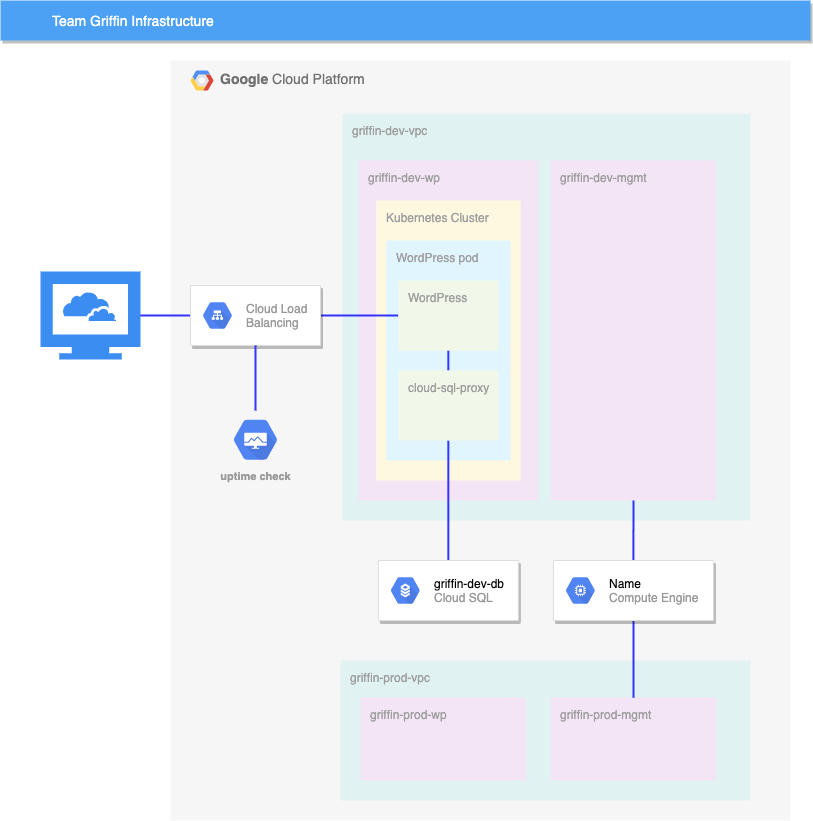
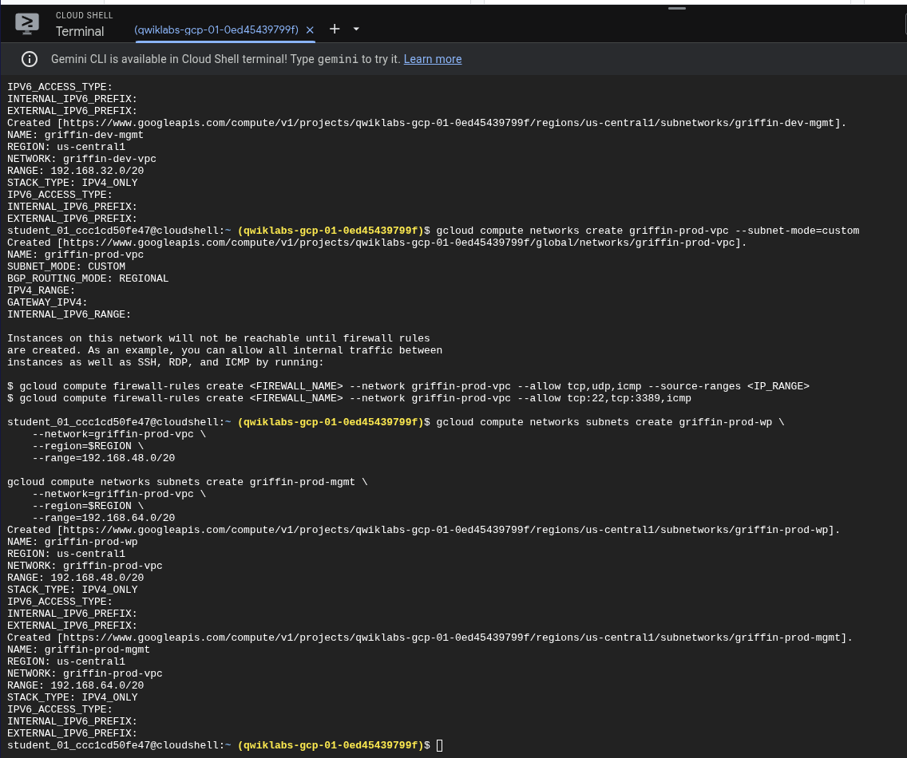
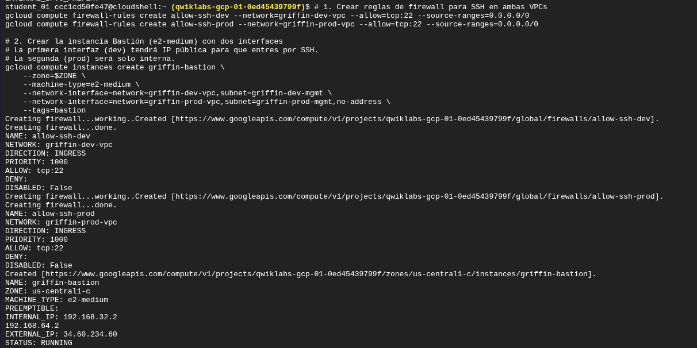
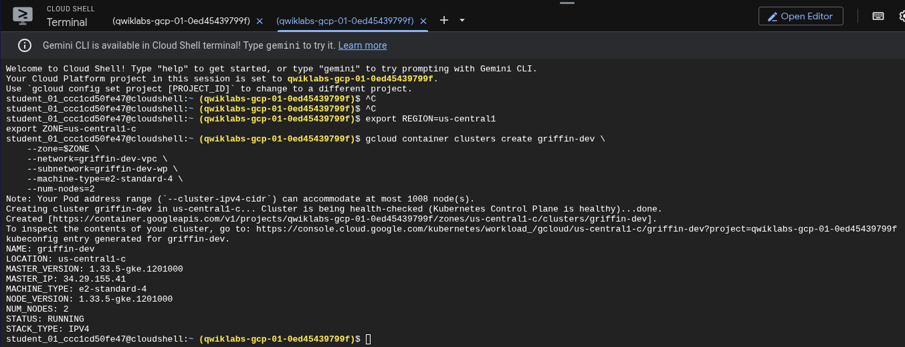
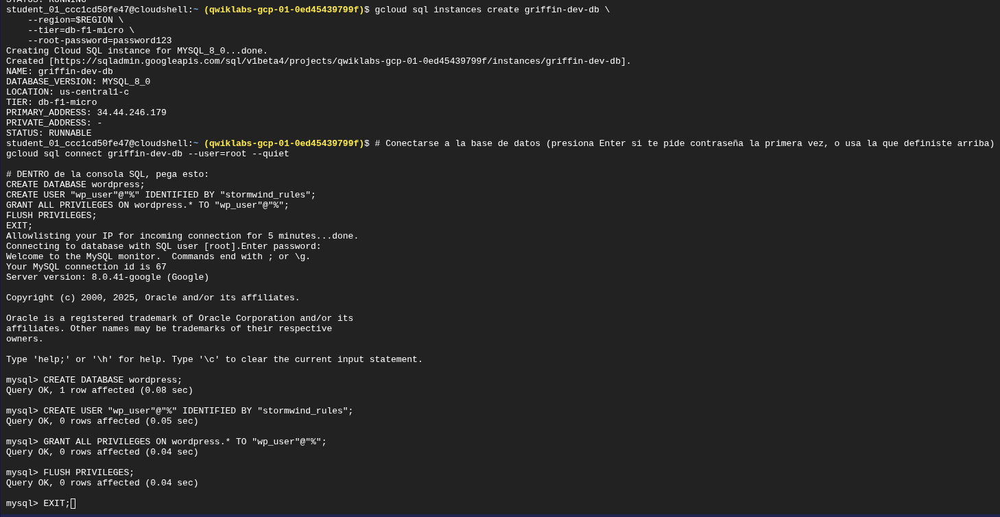
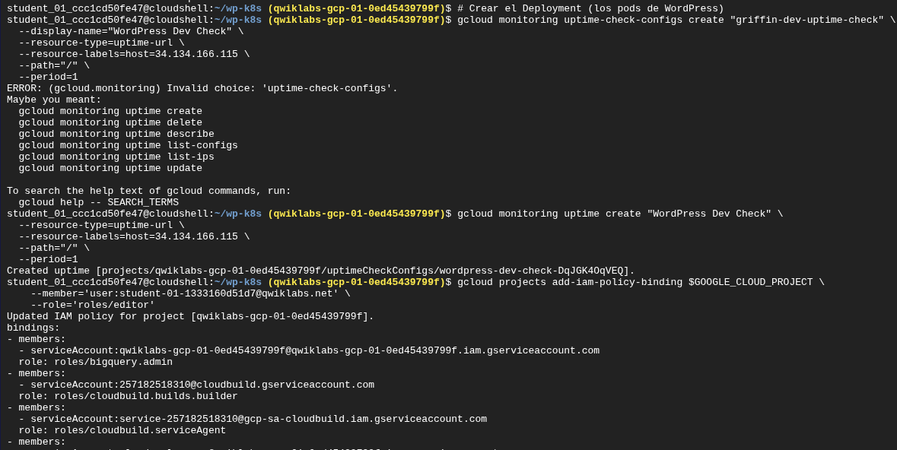

# Reporte de Laboratorio: Desarrolla tu red de Google Cloud (GSP321) - Lab de Desafío

Christhian Rodriguez

**Curso:** Google Cloud Skills Boost - Cloud Engineering

## 1. Resumen Ejecutivo y Escenario

### Situación

Jooli Inc. ha solicitado la configuración de una infraestructura de red robusta y segmentada para apoyar a su equipo de desarrollo (Griffin). El objetivo es desplegar un entorno de WordPress utilizando contenedores (Kubernetes) para el frontend y una base de datos administrada (Cloud SQL) para el backend.

### Objetivo

El desafío consiste en construir manualmente una arquitectura de red que incluya:

1. **Segregación de Redes:** VPCs separadas para Desarrollo y Producción.

2. **Seguridad:** Un host de bastión para acceso seguro y reglas de firewall.

3. **Contenedores:** Un clúster de Google Kubernetes Engine (GKE).

4. **Persistencia de Datos:** Cloud SQL para MySQL.

5. **Observabilidad:** Monitoreo de tiempo de actividad.

6. **Gestión de Accesos:** Configuración de roles IAM para colaboradores.

## 2. Arquitectura de la Solución

La solución implementada utiliza una arquitectura de microservicios sobre una infraestructura de red personalizada.

- **VPC de Desarrollo (`griffin-dev-vpc`):** Aloja el clúster de Kubernetes y la base de datos.

- **VPC de Producción (`griffin-prod-vpc`):** Preparada para futuras cargas de trabajo.

- **Bastión:** Instancia puente con interfaces en ambas redes para gestión segura.



*Figura 1: Diagrama de arquitectura propuesto para la infraestructura del equipo Griffin.*

## 3. Desarrollo e Implementación

Para asegurar la reproducibilidad y eficiencia, la mayoría de las tareas se realizaron utilizando `gcloud CLI` en Cloud Shell, en lugar de la consola gráfica.

### Fase 1: Configuración de Redes (VPC y Subredes)

Se crearon dos redes VPC en modo personalizado para tener control total sobre los rangos de IP.

**Comandos utilizados:**

```
# Variables de entorno para consistencia
export REGION=us-central1
export ZONE=us-central1-c

# Creación de VPCs y Subredes
gcloud compute networks create griffin-dev-vpc --subnet-mode=custom
gcloud compute networks subnets create griffin-dev-wp --network=griffin-dev-vpc --region=$REGION --range=192.168.16.0/20
gcloud compute networks subnets create griffin-dev-mgmt --network=griffin-dev-vpc --region=$REGION --range=192.168.32.0/20

# Repetición para Producción (Prod)
gcloud compute networks create griffin-prod-vpc --subnet-mode=custom
gcloud compute networks subnets create griffin-prod-wp --network=griffin-prod-vpc --region=$REGION --range=192.168.48.0/20
gcloud compute networks subnets create griffin-prod-mgmt --network=griffin-prod-vpc --region=$REGION --range=192.168.64.0/20
```



*Figura 2: Creación exitosa de las VPCs y subredes mediante Cloud Shell.*

### Fase 2: Host de Bastión y Seguridad

Se configuró una instancia de Compute Engine con **dos interfaces de red** (nic0 y nic1) para tener presencia simultánea en la red de desarrollo y producción, permitiendo la administración centralizada. Se habilitaron reglas de firewall para permitir SSH (Puerto 22).

**Comandos utilizados:**

```
# Crear reglas de firewall para SSH en ambas VPCs
gcloud compute firewall-rules create allow-ssh-dev --network=griffin-dev-vpc --allow=tcp:22 --source-ranges=0.0.0.0/0
gcloud compute firewall-rules create allow-ssh-prod --network=griffin-prod-vpc --allow=tcp:22 --source-ranges=0.0.0.0/0

# Crear la instancia Bastión con dos interfaces
gcloud compute instances create griffin-bastion \
    --zone=$ZONE \
    --machine-type=e2-medium \
    --network-interface=network=griffin-dev-vpc,subnet=griffin-dev-mgmt \
    --network-interface=network=griffin-prod-vpc,subnet=griffin-prod-mgmt,no-address \
    --tags=bastion
```



*Figura 3: Despliegue del host de bastión con múltiples interfaces de red.*

### Fase 3: Base de Datos y Kubernetes

Se desplegó una instancia de Cloud SQL y un clúster de GKE.

1. **Cloud SQL:** Se creó una instancia MySQL y se configuró la base de datos `wordpress` y el usuario `wp_user` mediante comandos SQL directos.

2. **GKE:** Se aprovisionó un clúster regional de 2 nodos.

**Comandos utilizados:**

```
# Crear instancia Cloud SQL
gcloud sql instances create griffin-dev-db --region=$REGION --tier=db-f1-micro --root-password=password123

# Configuración de base de datos (Ejecutado tras conectar con 'gcloud sql connect')
# CREATE DATABASE wordpress;
# CREATE USER "wp_user"@"%" IDENTIFIED BY "stormwind_rules";
# GRANT ALL PRIVILEGES ON wordpress.* TO "wp_user"@"%";
# FLUSH PRIVILEGES;

# Crear clúster GKE
gcloud container clusters create griffin-dev \
    --zone=$ZONE \
    --network=griffin-dev-vpc \
    --subnetwork=griffin-dev-wp \
    --machine-type=e2-standard-4 \
    --num-nodes=2
```



*Figura 4: Aprovisionamiento del clúster de Kubernetes 'griffin-dev'.*



*Figura 5: Creación de la base de datos y usuario SQL.*

### Fase 4: Despliegue de la Aplicación (WordPress)

Se utilizaron manifiestos de Kubernetes (`.yaml`) para desplegar WordPress, configurando secretos y volúmenes persistentes.

**Comandos utilizados:**

```
# Obtener credenciales del clúster y preparar archivos
gcloud container clusters get-credentials griffin-dev --zone=$ZONE
gsutil cp -r gs://spls/gsp321/wp-k8s .

# Crear Secretos para la DB y la Service Account
kubectl create secret generic cloudsql-db-credentials --from-literal=username=wp_user --from-literal=password=stormwind_rules
gcloud iam service-accounts keys create key.json --iam-account=cloud-sql-proxy@$GOOGLE_CLOUD_PROJECT.iam.gserviceaccount.com
kubectl create secret generic cloudsql-instance-credentials --from-file key.json

# Automatización: Inyectar nombre de conexión SQL en el YAML
export INSTANCE_CONNECTION_NAME=$(gcloud sql instances describe griffin-dev-db --format='value(connectionName)')
sed -i "s/YOUR_SQL_INSTANCE/$INSTANCE_CONNECTION_NAME/g" wp-deployment.yaml

# Aplicar configuraciones y despliegue
kubectl apply -f wp-env.yaml
kubectl apply -f wp-deployment.yaml
kubectl apply -f wp-service.yaml
```


*Figura 6: Generación de secretos en Kubernetes y aplicación de manifiestos.*

## 4. Resolución de Problemas (Troubleshooting)

Durante el despliegue, se encontró un error crítico al intentar acceder a la aplicación web.

Problema:

Al acceder a la IP externa del balanceador de carga, WordPress mostró el mensaje: "Error establishing a database connection".


*Figura 7: Error de conexión a la base de datos observado en el navegador.*

Análisis y Solución:

El error indicaba que los Pods de WordPress no podían autenticarse con Cloud SQL.

1. **Verificación SQL:** Se confirmó que el usuario `wp_user` existía y tenía permisos (`GRANT ALL`).

2. **Recreación de Secretos:** Se sospechó de un error en el Secret de Kubernetes `cloudsql-db-credentials`. Se eliminó y recreó el secreto asegurando que no hubiera caracteres ocultos.

3. **Reinicio de Pods:** Se eliminaron los Pods existentes (`kubectl delete pods --all`) para forzar al `Deployment` a crear nuevos Pods que leyeran el secreto corregido.

**Comandos de solución:**

```
# Recrear el secreto de credenciales
kubectl delete secret cloudsql-db-credentials
kubectl create secret generic cloudsql-db-credentials --from-literal=username=wp_user --from-literal=password=stormwind_rules

# Reiniciar pods para aplicar cambios
kubectl delete pods --all
```

**Resultado:** Tras el reinicio, la conexión se estableció correctamente y apareció el instalador de WordPress.

## 5. Monitoreo y IAM

Como pasos finales, se configuró una alerta de Uptime Check y se otorgaron permisos a un segundo ingeniero.

- **Nota Técnica:** Hubo un error inicial usando `gcloud monitoring uptime-check-configs` (comando deprecado). Se corrigió utilizando la sintaxis moderna `gcloud monitoring uptime create`.

**Comandos utilizados:**

```
# Crear Uptime Check (Comando corregido)
gcloud monitoring uptime create "WordPress Dev Check" \
  --resource-type=uptime-url \
  --resource-labels=host=[TU_IP_EXTERNA] \
  --path="/" \
  --period=1

# Asignar rol de Editor al segundo usuario
gcloud projects add-iam-policy-binding $GOOGLE_CLOUD_PROJECT \
    --member='user:[EMAIL_SEGUNDO_USUARIO]' \
    --role='roles/editor'
```



*Figura 8: Creación exitosa del Uptime Check y asignación de rol de Editor.*

## 6. Cheat Sheet de Comandos Clave

| **Acción**              | **Comando / Explicación**                                                             |
| ----------------------- | ------------------------------------------------------------------------------------- |
| **Crear VPC**           | `gcloud compute networks create [NOMBRE] --subnet-mode=custom`                        |
| **Crear Subred**        | `gcloud compute networks subnets create ... --range=[CIDR]`                           |
| **Instancia Multi-NIC** | `gcloud compute instances create ... --network-interface=... --network-interface=...` |
| **Conectar SQL**        | `gcloud sql connect [INSTANCIA] --user=root`                                          |
| **Credenciales GKE**    | `gcloud container clusters get-credentials [CLUSTER]`                                 |
| **Crear Secreto K8s**   | `kubectl create secret generic [NOMBRE] --from-literal=key=value`                     |
| **Ver Servicios**       | `kubectl get services -w` (El flag `-w` observa cambios en tiempo real)               |
| **Edición rápida**      | `sed -i "s/viejo/nuevo/g" archivo` (Reemplazo de texto en línea)                      |

## 7. Conclusiones

Este laboratorio demostró la importancia de la **Infraestructura como Código** al utilizar la línea de comandos para desplegar un entorno complejo.

**Puntos clave aprendidos:**

1. **VPCs Personalizadas:** Son esenciales para un control granular de la red, a diferencia de las redes automáticas.

2. **Troubleshooting en K8s:** Los errores de conexión suelen residir en la configuración de Secretos o en la necesidad de reiniciar los Pods para aplicar cambios.

3. **Interconexión de Servicios:** El uso del Proxy de Cloud SQL (sidecar) es fundamental para conectar GKE con Cloud SQL de forma segura sin exponer la base de datos a la red pública.

4. **Automatización:** Herramientas como `sed` y variables de entorno (`$REGION`) reducen el error humano significativamente.

Resultado Final:

El laboratorio fue completado con éxito obteniendo una puntuación de 100/100.


*Figura 9: Estado final de los recursos en la consola de Google Cloud.*
