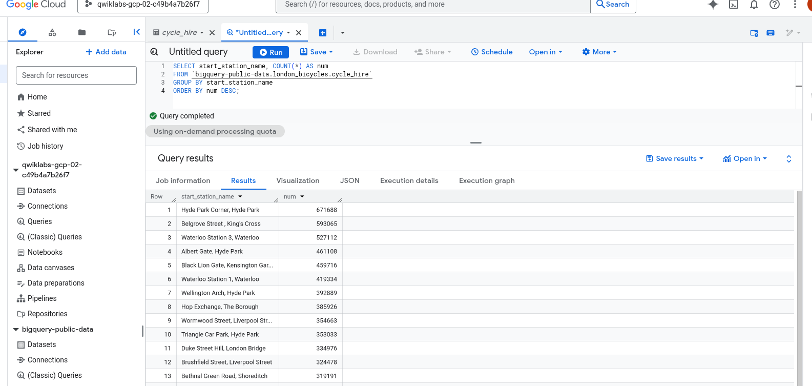
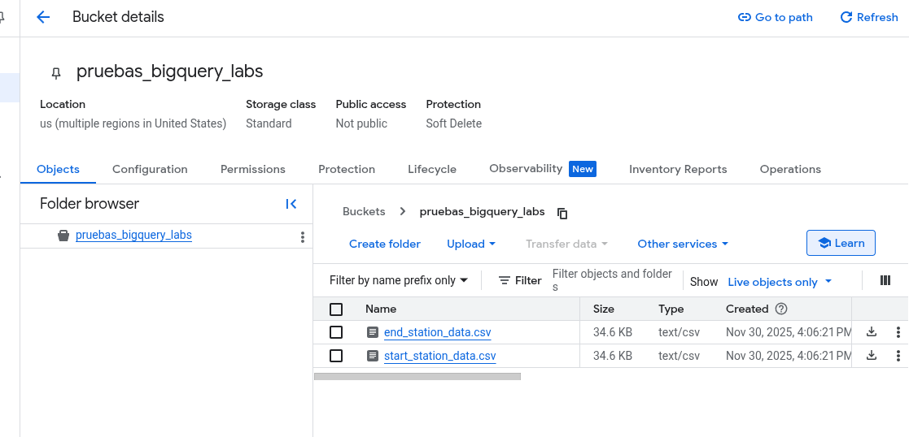
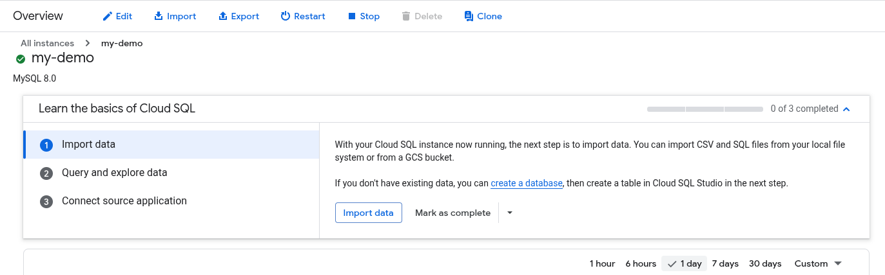
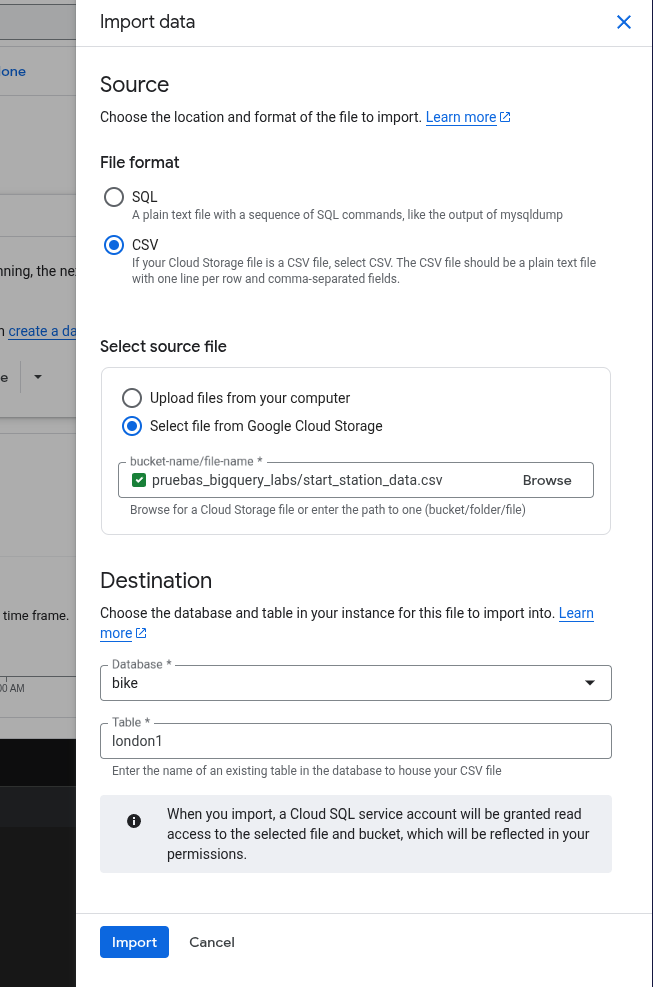

# Reporte Técnico: Introducción a SQL, BigQuery y Cloud SQL

**Laboratorio:** GSP281 - Google Cloud Skills Boost

**Autor:** Christhian Rodriguez

**Fecha:** 30 de Noviembre, 2025

## 1. Resumen Ejecutivo

En este laboratorio práctico se diseñó y ejecutó un flujo de trabajo de **Ingeniería de Datos (ETL)** básico en Google Cloud Platform. El objetivo fue extraer datos masivos de un almacén de datos (BigQuery), transformarlos ligeramente y cargarlos en una base de datos relacional transaccional (Cloud SQL) para su gestión operativa. Se utilizaron servicios clave como **BigQuery**, **Cloud Storage** y **Cloud SQL**, interconectados mediante SQL y la consola de GCP.

## 2. Arquitectura y Tecnologías Utilizadas

### 🧠 Google BigQuery (El Cerebro Analítico)

Es un **Data Warehouse serverless** (sin servidor) diseñado para analizar petabytes de datos a gran velocidad.

- **¿Qué hice aquí?** Lo usé para explorar un dataset público masivo (`london_bicycles`) que contiene millones de registros de viajes en bicicleta. BigQuery es perfecto para *leer* y *analizar* estos volúmenes gigantescos que matarían a una base de datos normal.

### 🗄️ Google Cloud Storage (El Puente)

Es un servicio de almacenamiento de objetos (como un Google Drive vitaminado para apps).

- **¿Qué hice aquí?** Actuó como "zona de paso" (Staging Area). BigQuery no puede mandar datos directamente a Cloud SQL, así que usamos un Bucket de Cloud Storage para alojar los archivos CSV intermedios.

### 🐬 Google Cloud SQL (La Memoria Operativa)

Es un servicio de bases de datos relacionales totalmente administrado (en este caso, MySQL).

- **¿Qué hice aquí?** Creé una instancia MySQL para recibir los datos procesados y simular un entorno donde una aplicación web podría leer o escribir datos transaccionales (como registrar un nuevo viaje en tiempo real).

## 3. Desarrollo del Laboratorio (Paso a Paso)

### Fase 1: Extracción y Análisis en BigQuery

Accedí al dataset público de bicicletas de Londres. Utilicé SQL para agrupar y contar los viajes por estaciones de inicio y fin.

Consulta ejecutada:

Se identificaron las estaciones con mayor tráfico.

> *Evidencia: Ejecución de consultas en la interfaz de BigQuery.*
> 
> 

### Fase 2: Exportación y Staging (ETL)

Los resultados de las consultas se exportaron como archivos CSV (`start_station_data.csv` y `end_station_data.csv`). Posteriormente, se creó un **Bucket** en Cloud Storage para alojar estos archivos, sirviendo como puente hacia la base de datos SQL.

> *Evidencia: Archivos CSV cargados en el Bucket de Cloud Storage.*
> 
> 
> 
> 

### Fase 3: Aprovisionamiento de Infraestructura

Desplegué una instancia de **Cloud SQL (MySQL 8.0)** en la región `us-east4`. Se configuró como una instancia "Enterprise" con perfil de desarrollo para optimizar costos, garantizando conectividad segura mediante autenticación de usuario root.

> *Evidencia: Instancia 'my-demo' operativa.*
> 
> 

### Fase 4: Definición de Esquema y Carga de Datos

Mediante **Cloud Shell**, me conecté a la instancia MySQL y definí el esquema de la base de datos (DDL):

```
CREATE DATABASE bike;
USE bike;
CREATE TABLE london1 (start_station_name VARCHAR(255), num INT);
CREATE TABLE london2 (end_station_name VARCHAR(255), num INT);
```

Posteriormente, utilicé la función de **Importación** de Cloud SQL para inyectar los datos desde el Bucket hacia estas tablas.

> *Evidencia: Estructura de tablas creada vía terminal.*
> 
> 

> *Evidencia: Proceso de importación desde Cloud Storage.*
> 
> 
> 
> 

## 4. Cheat Sheet: SQL Básico Aprendido

Durante el laboratorio, se utilizaron comandos fundamentales del Lenguaje de Consulta Estructurado (SQL):

| **Comando**  | **Explicación Humana**                 | **Ejemplo del Lab**                                         |
| ------------ | -------------------------------------- | ----------------------------------------------------------- |
| **SELECT**   | "Dame estos datos..."                  | `SELECT start_station_name...`                              |
| **FROM**     | "...de esta tabla/lugar"               | `FROM bigquery-public-data...`                              |
| **WHERE**    | "Pero solo si cumplen esta condición"  | `WHERE num > 100000`                                        |
| **GROUP BY** | "Junta los repetidos en uno solo"      | Agrupar por nombre de estación para contar viajes.          |
| **ORDER BY** | "Ordénalos de mayor a menor"           | `ORDER BY num DESC`                                         |
| **UNION**    | "Pega los resultados de dos consultas" | Unir estaciones de inicio y fin en una sola lista.          |
| **DELETE**   | "Borra esto"                           | Eliminar los encabezados del CSV que se colaron como datos. |

## 5. Análisis de Seguridad: ¿Cómo protegemos esto?

*Pregunta crítica de ingeniería: En un entorno real, ¿cómo aseguramos este flujo?*

Si esto fuera producción, aplicaríamos las siguientes capas de defensa:

1. **Principio de Mínimo Privilegio (IAM):**
   
   - No usar el usuario `root` de la base de datos para las aplicaciones. Crear usuarios específicos con permisos limitados (solo `SELECT` o `INSERT`).
   
   - La cuenta de servicio que hace la importación solo debe tener permiso de `Storage Object Viewer` en el Bucket específico, no en todo el proyecto.

2. **Seguridad de Red (VPC):**
   
   - **IP Privada:** La instancia Cloud SQL no debería tener IP pública (como tenía en el lab). Debería ser accesible solo desde dentro de la red privada de Google (VPC) para evitar ataques desde internet.
   
   - **Cloud SQL Auth Proxy:** Para conectarnos desde nuestra máquina, usaríamos el Auth Proxy, que crea un túnel encriptado y seguro sin exponer la base de datos.

3. **Encriptación:**
   
   - Los datos en **reposo** (guardados en el disco de Google) ya están encriptados por defecto.
   
   - Los datos en **tránsito** (mientras viajan del Bucket a SQL) viajan por la red interna de Google, protegidos por TLS.

4. **VPC Service Controls:**
   
   - Crear un perímetro de seguridad que impida que los datos del Bucket o de BigQuery sean copiados a proyectos externos no autorizados (protección contra exfiltración de datos).

## 6. Conclusión

Este laboratorio demostró el ciclo de vida de los datos en la nube: **Análisis Masivo (BigQuery) -> Persistencia (Storage) -> Operación (Cloud SQL)**. Se validó la capacidad de Google Cloud para integrar servicios heterogéneos mediante estándares abiertos como SQL y CSV, permitiendo mover información valiosa desde un almacén de "Big Data" hacia sistemas transaccionales listos para el consumo de aplicaciones.
