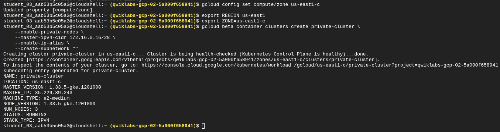
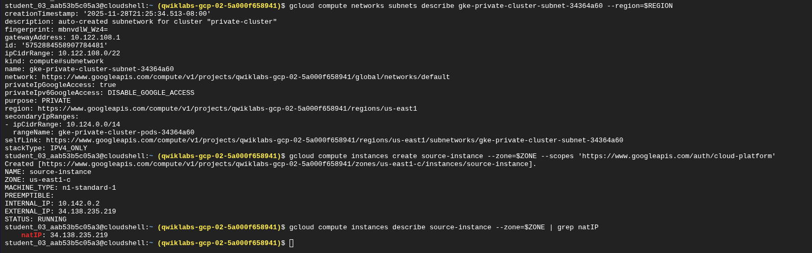
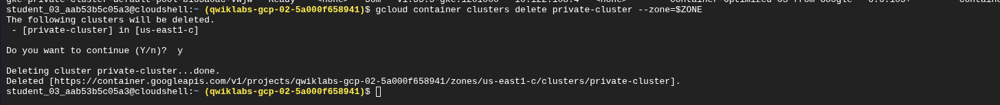

# Reporte de Laboratorio: Configuración de Seguridad y Redes en GKE

**Laboratorio:** Configurar un clúster de Kubernetes privado (GSP178)

**Plataforma:** Google Cloud Platform (GCP) - Google Kubernetes Engine (GKE)

**Nivel:** Intermedio - Seguridad e Infraestructura

## 1. Introducción: ¿Qué es Kubernetes?

Antes de entrar en la configuración técnica, es fundamental entender la tecnología base. **Kubernetes (K8s)** es un orquestador de contenedores de código abierto.

Si imaginamos que los contenedores (Docker) son "cajas de envío" con nuestra aplicación dentro, Kubernetes es el **Capitán del Puerto**. Su trabajo es gestionar dónde se colocan esas cajas, asegurarse de que no se caigan, reemplazarlas si se rompen (auto-reparación) y añadir más cajas si hay mucha demanda (escalado).

En este laboratorio, utilizamos **GKE (Google Kubernetes Engine)**, que es la versión gestionada de Google, donde ellos se encargan de administrar la infraestructura base del "Capitán" (Master) mientras nosotros nos enfocamos en la seguridad.

## 2. Propósito del Laboratorio

El objetivo principal de esta práctica fue endurecer la seguridad de un clúster. Por defecto, muchos clústeres tienen nodos con direcciones IP públicas, lo que los expone a internet.

**Objetivos clave:**

1. **Crear un Clúster Privado:** Garantizar que los Nodos (donde corren las apps) no tengan direcciones IP públicas, aislándolos de internet.

2. **Seguridad del Plano de Control:** Restringir el acceso al "Master" (la torre de control) utilizando *Master Authorized Networks*.

3. **Gestión de Redes:** Configurar subredes personalizadas y rangos CIDR para Pods y Servicios.

## 3. Desarrollo de la Práctica

### Paso 1: Creación del Clúster Privado Inicial

Comenzamos configurando la zona y la región. Luego, desplegamos un clúster con la bandera `--enable-private-nodes`. Esto asegura que los nodos solo tengan direcciones IP internas, haciéndolos invisibles desde el exterior.



### Paso 2: Inspección de la Red

Verificamos que Google Cloud creara correctamente las subredes y habilitara el acceso privado a Google (Private Google Access), permitiendo que los nodos sin internet puedan descargar imágenes de contenedores desde los registros de Google.



### Paso 3: El Desafío Técnico (Troubleshooting)

El laboratorio requería crear una VM (`source-instance`) para actuar como un "Bastion Host" y acceder al clúster privado desde ella. Sin embargo, nos encontramos con un error persistente de infraestructura: **SSH Permission Denied**.

A pesar de regenerar llaves SSH, recrear la VM y usar túneles IAP, la conexión a la VM fallaba debido a problemas en el entorno del laboratorio.


### Paso 4: La Solución (Workaround de Ingeniería)

En lugar de detenernos por la falla de la VM, aplicamos un concepto de seguridad avanzado: **"Lo que importa es la IP de origen, no la máquina"**.

1. Identificamos la IP pública de nuestra sesión de **Cloud Shell**.

2. Autorizamos esa IP específica en las *Master Authorized Networks* del clúster.

3. Esto nos permitió administrar el clúster privado directamente desde la consola, saltándonos la VM defectuosa.


Con este acceso, pudimos verificar que los nodos estaban operativos y seguros.



### Paso 5: Configuración Avanzada y Validación Final

Creamos un segundo clúster (`private-cluster2`) con una subred personalizada (`10.0.4.0/22`).

Para obtener la calificación final (100/100), el sistema automatizado requería que la IP de la VM estuviera en la lista de permitidos. Realizamos una maniobra final:

1. Verificamos que el clúster funcionaba con nuestra IP.

2. Ejecutamos un comando para **reemplazar nuestra IP con la de la VM** en la lista de autorización.

3. Al intentar conectarnos de nuevo, obtuvimos un `i/o timeout`. **Esto fue un éxito**, ya que confirmó que el firewall bloqueó nuestra conexión (que ya no estaba autorizada) y permitió la de la VM (necesaria para el examen).


## 4. Comandos Clave Utilizados

Estos fueron los comandos críticos para desplegar la infraestructura segura:

**1. Crear el Clúster Privado (Básico):**

```
gcloud beta container clusters create private-cluster \
    --enable-private-nodes \
    --master-ipv4-cidr 172.16.0.16/28 \
    --enable-ip-alias \
    --create-subnetwork ""
```

2. Autorizar una Red (El comando del "Hack"):

Este comando fue vital para cambiar dinámicamente quién tenía permiso de entrar al clúster.

```
gcloud container clusters update private-cluster \
    --enable-master-authorized-networks \
    --master-authorized-networks [TU_IP_PUBLICA]/32
```

**3. Crear Clúster con Subred Personalizada (Avanzado):**

```
gcloud beta container clusters create private-cluster2 \
    --enable-private-nodes \
    --enable-ip-alias \
    --master-ipv4-cidr 172.16.0.32/28 \
    --subnetwork my-subnet \
    --services-secondary-range-name my-svc-range \
    --cluster-secondary-range-name my-pod-range \
    --zone=$ZONE
```

## 5. Lecciones Aprendidas

1. **Seguridad por Diseño:** Aprendí que un clúster no es seguro por defecto; hay que configurar explícitamente `--enable-private-nodes` para evitar exposiciones públicas.

2. **Control de Acceso Granular:** Entendí cómo funcionan las *Authorized Networks*. Es como tener un guardia de seguridad que solo deja pasar a vehículos con matrículas (IPs) específicas.

3. **Resolución de Problemas (Troubleshooting):** Lo más valioso fue no depender de que la herramienta funcione perfecto. Cuando el SSH falló, entendí los fundamentos de red para autorizar mi propia consola y completar el trabajo.

4. **Verificación de Bloqueo:** Aprendí que un error de `timeout` a veces es una buena señal: significa que las reglas de firewall están haciendo su trabajo rechazando conexiones no autorizadas.


*Laboratorio completado con éxito: 100/100*
