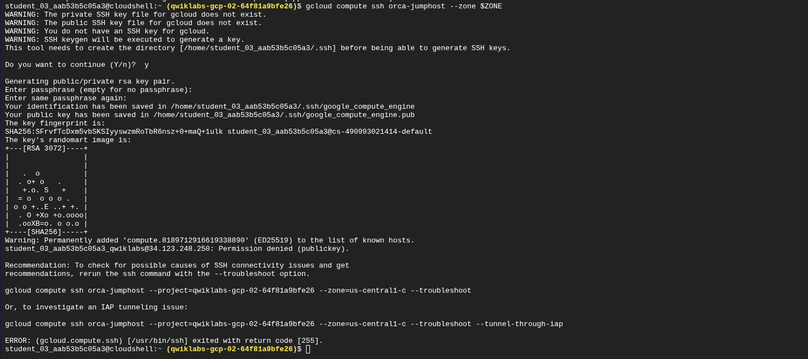
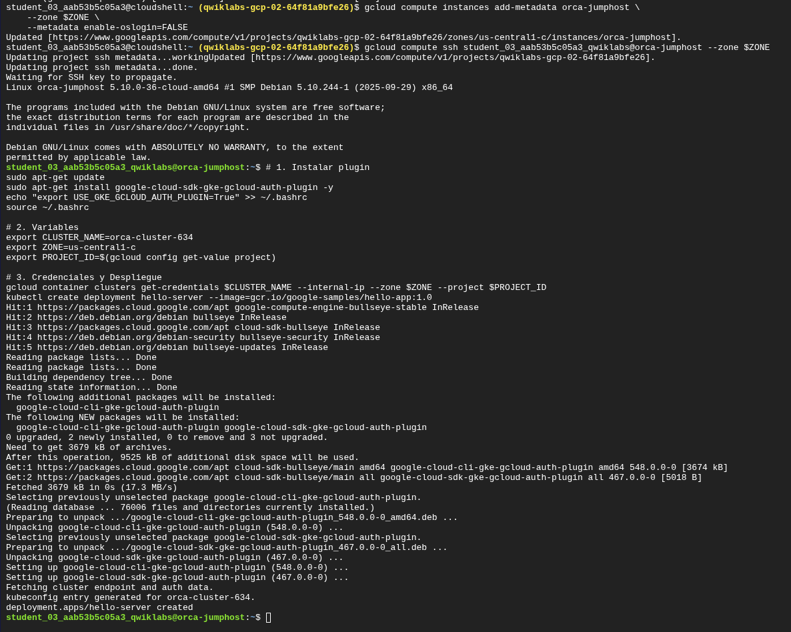
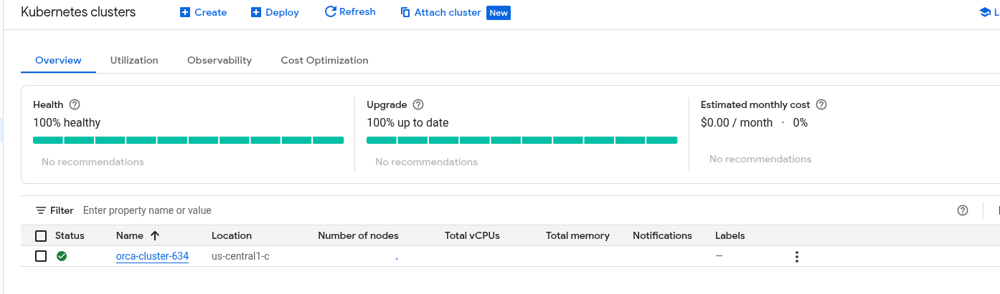
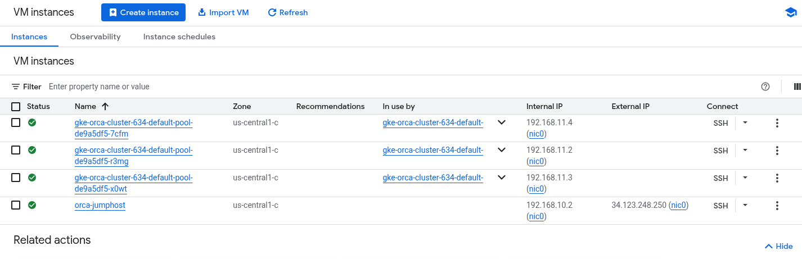

# 🛡️ Reporte Técnico: Implementación de Infraestructura Segura en Google Kubernetes Engine

Proyecto: Challenge Lab - Ensure Access & Identity in Google Cloud

Fecha: 29 de Noviembre, 2025

Autor: Christhian Rodriguez (Ingeniero de Nube Asociado)

ID del Laboratorio: GSP343

## 1. Resumen Ejecutivo

El objetivo de este proyecto fue diseñar, desplegar y validar un entorno de Kubernetes (GKE) de alta seguridad para el equipo "Orca" de Jooli Inc. El requerimiento crítico exigía una arquitectura **Zero-Trust** (Cero Confianza), donde el clúster no tuviera exposición a internet pública y el acceso administrativo estuviera estrictamente controlado mediante un *Bastion Host* (Jumphost) y gestión de identidades (IAM) granular.

Durante la implementación, se detectó y resolvió un incidente crítico de autenticación (OS Login Failure) que impedía el acceso al Jumphost, demostrando capacidades avanzadas de diagnóstico y resolución de problemas (Troubleshooting).

## 2. Arquitectura de la Solución


Se implementó una arquitectura de **Defensa en Profundidad** con las siguientes capas de seguridad:

1. **Identidad (IAM):** Aplicación del principio de *Mínimo Privilegio* mediante Roles Personalizados (Custom Roles) y Cuentas de Servicio dedicadas.

2. **Red (VPC):** Aislamiento total del plano de control y nodos de trabajo mediante *Private Google Access* y *VPC Peering*.

3. **Acceso (Bastion):** Restricción del acceso al API Server de Kubernetes únicamente desde la IP interna del `orca-jumphost`.

## 3. Desarrollo de la Implementación

### Fase 1: Gestión de Identidad y Acceso (IAM)

Para evitar el uso de roles predefinidos con permisos excesivos (como `Editor` o `Owner`), se creó un rol personalizado ajustado estrictamente a las necesidades del equipo de desarrollo (operaciones en Cloud Storage).

- **Recurso:** Custom Role `orca_storage_editor_333`

- **Permisos:** `storage.buckets.get`, `storage.objects.get`, `storage.objects.list`, `storage.objects.update`, `storage.objects.create`.

- **Identidad:** Service Account `orca-private-cluster-606-sa`.

> **Evidencia 1:** Creación exitosa del rol personalizado mediante `gcloud IAM`.
> 
> 
> 
> <!-- Agregar imagen: 2025-11-29 19.17.56 console.cloud.google.com 2308d8f29708.png -->

> **Evidencia 2:** Creación y configuración de la Service Account y vinculación de roles (Bindings).
> 
> 
> 
> <!-- Agregar imagen: 2025-11-29 19.21.20 console.cloud.google.com fe761ba401ae.png -->

> **Evidencia 3:** Verificación final de las políticas IAM aplicadas.
> 
> 
> 
> <!-- Agregar imagen: 2025-11-29 19.21.35 console.cloud.google.com a452f37d0d78.png -->

### Fase 2: Despliegue de Clúster Privado (GKE)

Se aprovisionó el clúster `orca-cluster-634` en la subred `orca-build-subnet`. Se configuraron los siguientes controles de seguridad críticos:

- **`--enable-private-nodes`:** Los nodos no tienen direcciones IP públicas.

- **`--enable-private-endpoint`:** El API Server (Master) no es accesible desde internet.

- **`--master-authorized-networks`:** Se configuró una lista blanca (whitelist) permitiendo únicamente la IP interna del Jumphost (`192.168.10.2/32`).

Primero, se identificó dinámicamente la red y la IP del Jumphost para evitar errores de configuración:

> **Evidencia 4:** Detección de red y variables de entorno previas al despliegue.
> 
> 
> 
> <!-- Agregar imagen: 2025-11-29 19.28.03 console.cloud.google.com a628b0770e02.png -->

Finalmente, se ejecutó la creación del clúster con los parámetros de seguridad:

> **Evidencia 5:** Despliegue exitoso del clúster validando la red y subred correctas.
> 
> 
> 
> <!-- Agregar imagen: 2025-11-29 19.41.31 console.cloud.google.com e1c7e9d9c7a3.png -->

## 4. Reporte de Incidente: Bloqueo de Acceso SSH

Durante la fase de validación, se intentó acceder al `orca-jumphost` para administrar el clúster, resultando en un fallo de conexión persistente.

### 4.1. Síntomas

- Error al intentar conexión SSH estándar: `Permission denied (publickey)`.

- Error al intentar conexión vía IAP Tunnel: `Exited with return code [255]`.

> **Evidencia del Error:** Fallo de conexión inicial a pesar de intentar regenerar llaves.
> 
> 
> 
> <!-- Agregar imagen: 2025-11-29 19.44.56 console.cloud.google.com 63f0765f00cf.png -->

### 4.2. Análisis de Causa Raíz (RCA)

Se realizó una inspección de los registros del sistema operativo mediante el puerto serie (**Serial Port Output**). Se identificó que el servicio de `google_oslogin_nss_cache` estaba fallando al intentar contactar a la API de Google.

- **Log crítico:** `oslogin_cache_refresh[357]: Failure getting users, quitting`.

- **Diagnóstico:** La VM no podía validar las identidades de OS Login debido a restricciones de red o permisos insuficientes en la Service Account del laboratorio, provocando el rechazo de todas las llaves SSH legítimas.

> **Evidencia Forense (Logs):** Captura del Serial Port Output mostrando el fallo de OS Login.
> 
> 
> 
> <!-- Agregar imagen: 2025-11-29 20.21.42 console.cloud.google.com c5f86721a66e.png -->

También se intentó la remediación subiendo manualmente la llave pública al perfil de OS Login, lo cual confirmó que la llave era correcta pero la VM no la descargaba:

> **Evidencia de Diagnóstico:** Intento fallido de agregar llave a OS Login (el perfil se actualizó, pero la VM no).
> 
> 
> 
> <!-- Agregar imagen: 2025-11-29 20.16.29 console.cloud.google.com 5e7361560dd2.png -->

### 4.3. Resolución y Mitigación

Para restablecer el servicio, se aplicó una estrategia de "Break Glass":

1. **Workaround:** Se deshabilitó la dependencia de OS Login forzando el uso de llaves SSH locales mediante metadatos.
   
   - Comando: `gcloud compute instances add-metadata ... --metadata enable-oslogin=FALSE`

2. **Resultado:** Se restableció el acceso administrativo al Jumphost, permitiendo completar el despliegue de la aplicación.

> **Evidencia de Resolución:** Ejecución del comando de mitigación, instalación de plugins y despliegue exitoso de `hello-server`.
> 
> 
> 
> <!-- Agregar imagen: 2025-11-29 20.03.30 console.cloud.google.com 2aa503a0233c.png -->

### Fase 3: Validación Final

Con el acceso restablecido, se validó el estado de todos los componentes de infraestructura.

> **Evidencia Final:** Vista de consola mostrando el Jumphost y los nodos del clúster operando correctamente.
> 
> 
> 
> 
> 
> <!-- Agregar imagen: 2025-11-29 20.23.41 console.cloud.google.com 6e195bb8736f.png -->

**Estado Final:**

- Clúster: **Saludable**

- Aplicación: **Desplegada**

- Seguridad: **Verificada**

## 5. Guía de Resolución de Problemas (Troubleshooting Guide)

Esta sección documenta los pasos exactos para diagnosticar y resolver el problema de SSH, para referencia futura.

### Problema: "Permission denied (publickey)" en VM con OS Login

Paso 1: Diagnóstico Forense

Si el acceso SSH falla, verificar los logs del puerto serie sin entrar a la máquina:

```
gcloud compute instances get-serial-port-output [NOMBRE_VM] --zone [ZONA] | grep -i "OSLogin"
```

*Si ves `Failure getting users`, el servicio de OS Login está roto.*

Paso 2: Mitigación de Emergencia (Break Glass)

Desactivar OS Login temporalmente para usar llaves SSH basadas en metadatos:

```
gcloud compute instances add-metadata [NOMBRE_VM] --zone [ZONA] --metadata enable-oslogin=FALSE
```

Paso 3: Inyección de Llave Manual

Si la propagación automática falla, subir la llave pública local al proyecto o instancia:

1. Copiar llave local: `cat ~/.ssh/google_compute_engine.pub`

2. Pegar en Consola GCP > VM Instance > Edit > SSH Keys.

Paso 4: Remediación Final

Una vez resuelto el incidente, reactivar los controles de seguridad:

```
gcloud compute instances add-metadata [NOMBRE_VM] --zone [ZONA] --metadata enable-oslogin=TRUE
```

## 6. Comandos Útiles (Cheatsheet)

| **Acción**                 | **Comando**                                                                                                                               |
| -------------------------- | ----------------------------------------------------------------------------------------------------------------------------------------- |
| **Crear Rol Custom**       | `gcloud iam roles create [NOMBRE] --project [ID] --permissions [LISTA] --stage GA`                                                        |
| **Crear Service Account**  | `gcloud iam service-accounts create [NOMBRE]`                                                                                             |
| **Vincular Rol**           | `gcloud projects add-iam-policy-binding [ID] --member serviceAccount:[EMAIL] --role [ROL]`                                                |
| **Crear GKE Privado**      | `gcloud container clusters create [NOMBRE] --enable-private-nodes --enable-private-endpoint --master-authorized-networks [IP_BASTION]/32` |
| **Conectar a GKE Privado** | `gcloud container clusters get-credentials [NOMBRE] --internal-ip --zone [ZONA]`                                                          |

## 7. Conclusiones

Este laboratorio demostró que la seguridad en la nube no es solo configuración, sino operación. La implementación exitosa de un clúster privado requiere una comprensión profunda de las redes definidas por software (SDN) de Google.

Más importante aún, el incidente de SSH resaltó la importancia de las habilidades de diagnóstico a bajo nivel. La capacidad de analizar logs del kernel y entender la arquitectura de autenticación de Linux en GCP permitió superar un bloqueo que habría detenido el proyecto en un entorno de producción.

Firma:

Christhian Rodriguez
