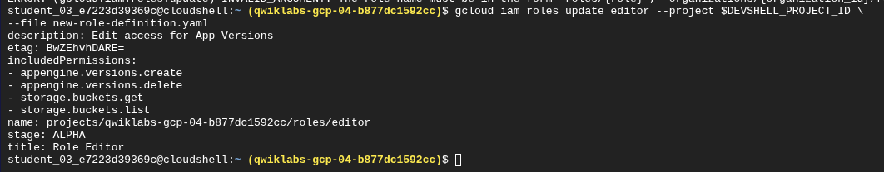
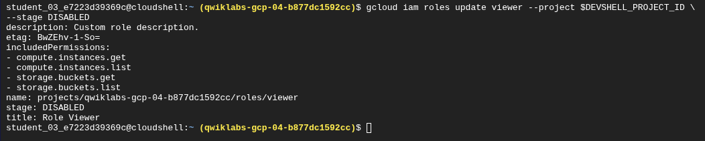

# Reporte Técnico: Gestión de Roles Personalizados en Google Cloud IAM

**Laboratorio:** GSP190 - Roles personalizados de IAM

**Plataforma:** Google Cloud Platform (GCP)

**Herramientas:** Cloud Shell, gcloud SDK

## 1. Introducción y Objetivo

En la administración de la nube, el principio de **Mínimo Privilegio** es fundamental para la seguridad. Aunque Google Cloud ofrece "Roles Predefinidos" mantenidos por Google, las organizaciones a menudo tienen requerimientos operativos específicos que no encajan perfectamente en estos moldes.

El objetivo de esta práctica de laboratorio fue dominar el ciclo de vida de los **Roles Personalizados** (Custom Roles). A diferencia de los roles predefinidos, estos son creados y mantenidos por el usuario, permitiendo agrupar permisos específicos (`service.resource.verb`) para satisfacer necesidades puntuales de negocio sin otorgar acceso excesivo.

## 2. Metodología y Ejecución

Para esta práctica, se utilizó el entorno de **Cloud Shell** para interactuar con la API de IAM mediante comandos de `gcloud`. Se exploraron dos métodos de creación: mediante archivos de configuración (YAML) y mediante "flags" (banderas) directas en la línea de comandos.

### Paso 1: Creación de un Rol mediante archivo YAML

El uso de archivos YAML es una buena práctica para la "Infraestructura como Código" (IaC), ya que permite versionar y auditar las definiciones de los roles.

- **Acción:** Se creó un archivo `role-definition.yaml` definiendo un rol "Role Editor" con permisos específicos para App Engine (`versions.create`, `versions.delete`).

- **Comando:**
  
  ```
  gcloud iam roles create editor --project $DEVSHELL_PROJECT_ID --file role-definition.yaml
  ```

- **Explicación:** Este comando lee la configuración local y la aplica al proyecto, creando el rol en estado ALPHA.


> *Evidencia: Creación exitosa del "Role Editor" usando la definición YAML.*

### Paso 2: Creación de un Rol mediante Flags (Línea de Comandos)

Para creaciones rápidas o scripts directos, se puede definir el rol sin archivos externos.

- **Acción:** Se creó un segundo rol llamado "Role Viewer" con permisos de solo lectura para Compute Engine.

- **Comando:**
  
  ```
  gcloud iam roles create viewer --project $DEVSHELL_PROJECT_ID \
  --title "Role Viewer" --description "Custom role description." \
  --permissions compute.instances.get,compute.instances.list --stage ALPHA
  ```


> *Evidencia: Creación del "Role Viewer" especificando permisos directamente en el comando.*

### Paso 3: Actualización de Roles (Gestión de Cambios)

Los requerimientos cambian con el tiempo. IAM utiliza `etag` para manejar la concurrencia y evitar conflictos durante las ediciones.

#### A. Actualización vía YAML

Se modificó el archivo YAML local para agregar permisos de Cloud Storage (`storage.buckets.get`, `storage.buckets.list`) y se aplicó la actualización.

- **Comando:** `gcloud iam roles update editor ... --file new-role-definition.yaml`



> *Evidencia: El "Role Editor" ahora incluye permisos de Storage tras la actualización.*

#### B. Actualización vía Flags

Se utilizó la bandera `--add-permissions` para agregar permisos de Storage al "Role Viewer" sin necesidad de editar un archivo.

- **Comando:**
  
  ```
  gcloud iam roles update viewer --project $DEVSHELL_PROJECT_ID \
  --add-permissions storage.buckets.get,storage.buckets.list
  ```


> *Evidencia: Modificación dinámica del "Role Viewer" agregando nuevos permisos.*

### Paso 4: Inhabilitación de Roles

A veces es necesario suspender un rol sin eliminarlo, por ejemplo, durante auditorías de seguridad o reestructuraciones.

- **Acción:** Se cambió el estado (`stage`) del rol a `DISABLED`. Esto detiene el efecto de cualquier vinculación de política asociada a este rol.

- **Comando:**
  
  ```
  gcloud iam roles update viewer --project $DEVSHELL_PROJECT_ID --stage DISABLED
  ```



> *Evidencia: El rol "viewer" muestra el estado DISABLED.*

### Paso 5: Borrado y Restauración (Undelete)

IAM permite un periodo de gracia (generalmente 7 días) para recuperar roles eliminados antes de que se borren permanentemente (proceso que toma 30+ días).

- **Acción:** Se eliminó el rol y posteriormente se restauró utilizando el comando `undelete`.

- **Comando:**
  
  ```
  gcloud iam roles undelete viewer --project $
  ```

> *Evidencia: Recuperación exitosa del rol previamente eliminado.*

## 3. Conclusiones y Aprendizaje

Una conclusión crítica de este laboratorio es la distinción operativa entre los **Roles Predefinidos** y los **Roles Personalizados**.

Mientras que los roles predefinidos son gestionados por Google y reciben actualizaciones automáticas de permisos cuando los servicios evolucionan, los **roles personalizados son responsabilidad del usuario**. Esto significa que si Google agrega una nueva funcionalidad a un servicio (por ejemplo, una nueva característica en App Engine), el rol personalizado no heredará el nuevo permiso automáticamente; el administrador debe actualizarlo manualmente.

Por lo tanto, el uso de roles personalizados es el estándar ideal para cumplir con el **Principio de Mínimo Privilegio (Least Privilege)**, otorgando solo lo estrictamente necesario, aunque esto conlleva una mayor carga administrativa de mantenimiento en comparación con la comodidad de los roles predefinidos."

A través de este laboratorio, consolidé los siguientes conocimientos clave para la administración de Google Cloud:

1. **Flexibilidad vs. Mantenimiento:** Los roles personalizados ofrecen gran precisión, pero requieren mantenimiento manual. A diferencia de los roles predefinidos, no se actualizan automáticamente cuando Google agrega nuevas funcionalidades a un servicio.

2. **Seguridad Granular:** Aprendí a descomponer servicios en permisos atómicos (`.get`, `.list`, `.create`) para otorgar solo lo estrictamente necesario.

3. **Gestión de Ciclo de Vida:** Comprendí que borrar un rol no es inmediato; la funcionalidad de `undelete` es crucial para la recuperación ante desastres o errores humanos.

4. **Automatización:** El uso de `gcloud` demuestra cómo estas tareas pueden ser automatizadas mediante scripts en un entorno de producción real, facilitando la gestión de permisos a escala.
