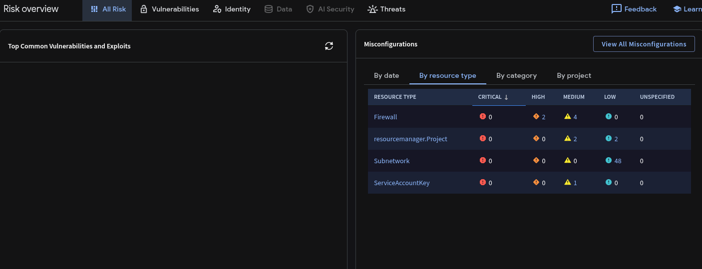
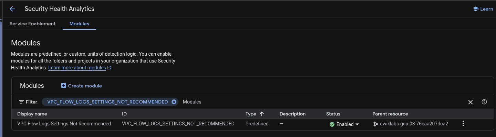
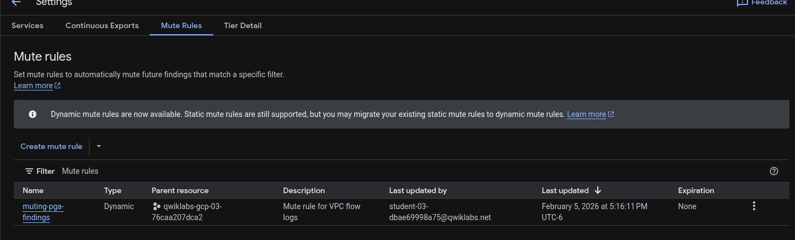
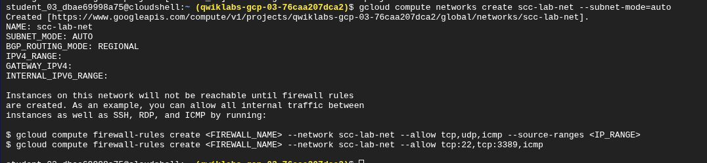
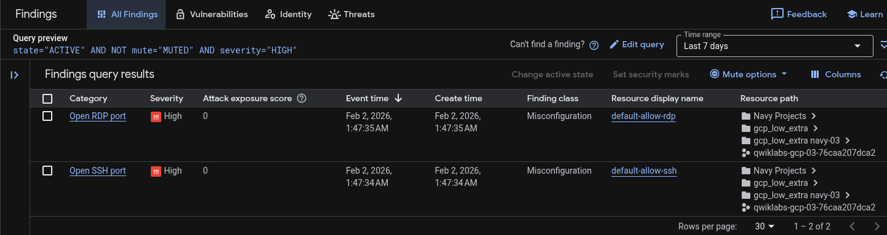
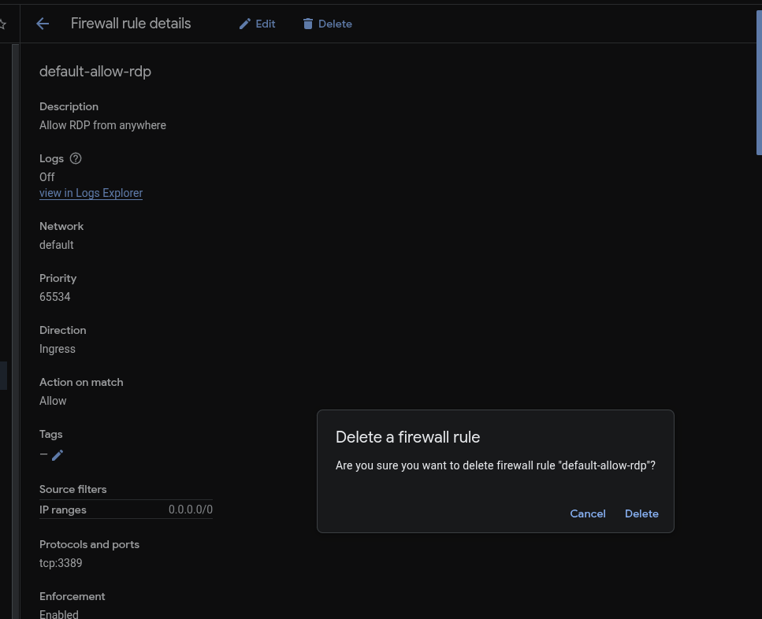
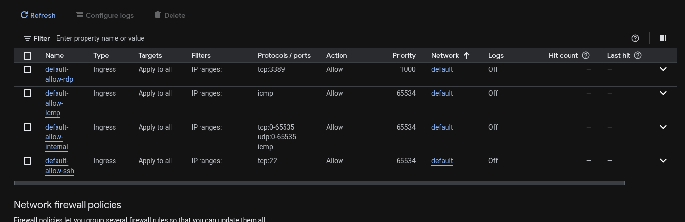

# Reporte Técnico: Comienza a usar Security Command Center (GSP1124)

**Fecha:** 05/02/2026

**Rol:** Cloud Security Engineer

**Contexto:** Cymbal Bank - Transformación Digital Segura

## 🏦 Resumen Ejecutivo

Cymbal Bank requiere una estrategia de seguridad centralizada para proteger su infraestructura de pagos. Como parte de la iniciativa de modernización, se implementó **Security Command Center (SCC)** para ganar visibilidad sobre vulnerabilidades en tiempo real y asegurar el cumplimiento normativo.

Este reporte documenta la fase inicial de:

1. Descubrimiento de activos y riesgos.

2. Afinamiento de reglas de detección (reducción de ruido).

3. Remediación crítica de superficie de ataque en red (RDP/SSH).

## 🔍 Fase 1: Evaluación de Postura Inicial (Discovery)

Al activar SCC en el proyecto de prueba, se identificó inmediatamente una superficie de ataque significativa derivada de configuraciones por defecto inseguras en la red VPC.

### Dashboard de Riesgos

El panel "Risk Overview" mostró un pico de configuraciones incorrectas (*Misconfigurations*), principalmente relacionadas con reglas de firewall permisivas.

*Estado inicial: SCC comienza a ingerir datos de los activos.*

Tras unos minutos de recolección de datos, el panel de "Misconfigurations" se pobló, revelando vulnerabilidades críticas.

*Vista de Misconfigurations mostrando actividad reciente.*

### Desglose por Tipo de Recurso

El análisis detallado mostró que el mayor riesgo residía en los **Firewalls** (Severidad Alta) y **Subredes** (Severidad Baja por falta de logs).

*Tabla de hallazgos clasificados por recurso y severidad.*

## ⚙️ Fase 2: Configuración de Security Health Analytics (SHA)

Para mejorar la auditoría de la red, se procedió a habilitar módulos específicos de detección que no vienen activos por defecto.

**Acción:** Se habilitó el módulo `VPC_FLOW_LOGS_SETTINGS_NOT_RECOMMENDED` en la configuración de SHA. Esto permite alertar cuando una subred no está registrando el tráfico.

*Activación del módulo de detección para VPC Flow Logs.*

## 🔇 Fase 3: Gestión de Hallazgos (Muting Rules)

Para evitar la "fatiga de alertas" en el equipo de seguridad (SOC), se configuraron reglas de silenciamiento (*Mute Rules*) para hallazgos de severidad baja o conocidos en entornos de desarrollo.

**Objetivo:** Silenciar automáticamente alertas de `FLOW_LOGS_DISABLED`.

### Creación de la Regla

Se configuró una regla dinámica con el query: `category="FLOW_LOGS_DISABLED"`.

*Configuración de la regla de silenciamiento.*

### ⚠️ Reto de Validación (Troubleshooting)

Durante la creación, el sistema de validación del laboratorio rechazó la regla inicialmente.

- **Error:** El script de auditoría requería una descripción exacta en inglés, aunque la interfaz permitía español.

- **Solución:** Se ajustó la metadata de la regla para cumplir con el estándar del script automatizado.

*El validador rechazando la configuración por discrepancia en la descripción.*

Una vez corregido, la regla se creó exitosamente y apareció en el listado activo.

### Verificación de la Regla

Para probar que la regla funcionaba en tiempo real, se creó una nueva red VPC (`scc-lab-net`) mediante Cloud Shell. Los hallazgos generados por esta nueva red fueron silenciados automáticamente, confirmando la eficacia de la regla.

*Creación de red de prueba para verificar supresión de alertas.*

## 🛡️ Fase 4: Remediación de Amenazas Críticas

Se identificaron hallazgos de **Severidad Alta** indicando puertos RDP (3389) y SSH (22) abiertos a todo internet (`0.0.0.0/0`).

*Detalle del hallazgo "Open RDP port" en la regla default-allow-rdp.*

### Procedimiento de Remediación (IAP)

En lugar de cerrar el puerto completamente, se restringió el acceso para permitir conexiones únicamente a través del **Identity-Aware Proxy (IAP)** de Google Cloud.

**Rango IP de IAP:** `35.235.240.0/20`

### ⚠️ Reto de Infraestructura (Troubleshooting)

Durante la remediación, se eliminó accidentalmente la regla de firewall original. Al intentar recrearla con un nombre personalizado (`allow-rdp-iap`), el sistema de validación falló.

- **Causa:** El script de validación buscaba estrictamente el nombre `default-allow-rdp`.

- **Solución:** Se recreó la regla de firewall manteniendo el nombre original "legacy" pero aplicando la configuración segura de IPs de IAP.

*Eliminación de la regla insegura.*

*Recreación de la regla apuntando al rango 35.235.240.0/20.*

*Confirmación de actualización exitosa.*

## ✅ Resultados y Conclusiones

Tras la aplicación de los controles de firewall, SCC actualizó el estado de los hallazgos críticos a **Inactivos**, mejorando drásticamente la postura de seguridad de Cymbal Bank.

### Estado Final del Firewall

Las reglas ahora permiten administración remota segura sin exponer los puertos directamente a internet.

*Lista de firewalls remediada.*

### Validación del Proyecto

El laboratorio fue completado exitosamente, demostrando dominio sobre la interfaz de SCC, gestión de reglas de silencio y remediación de redes.
