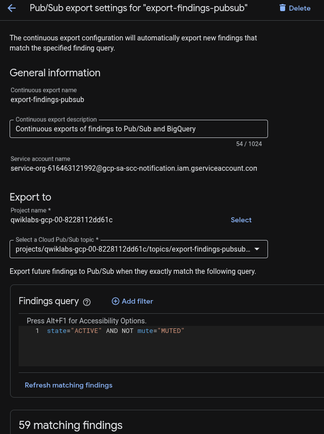
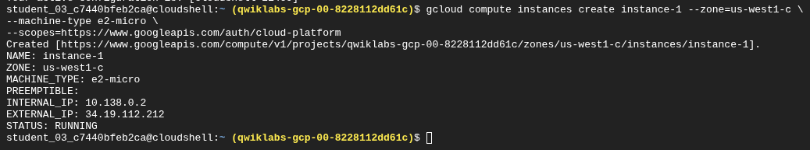
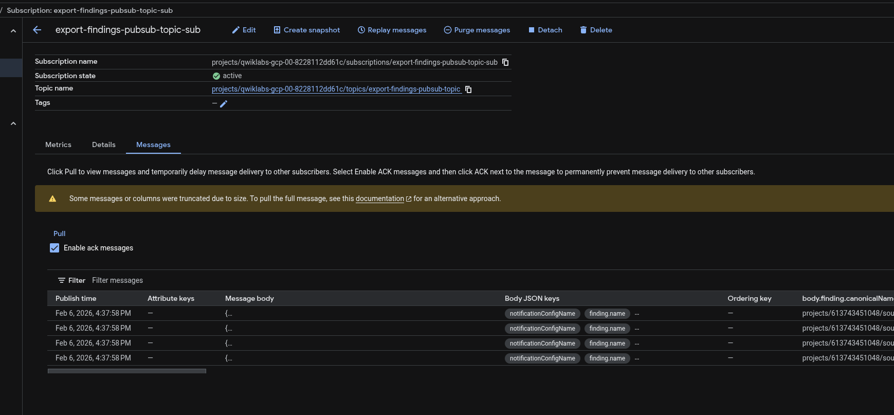
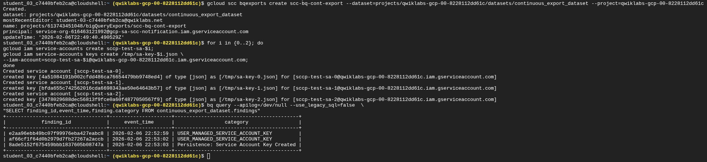
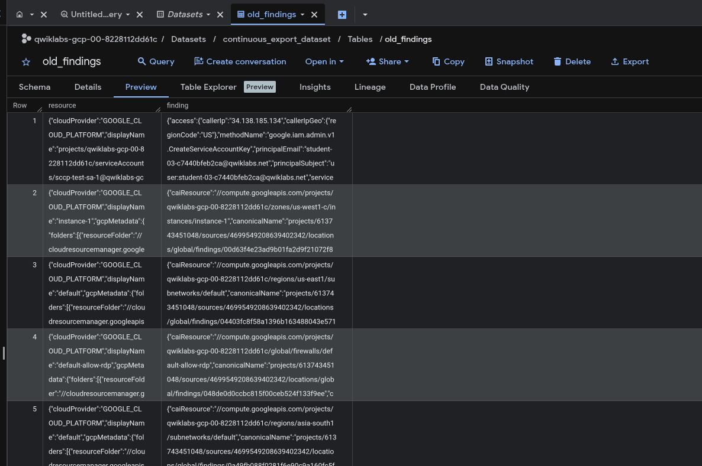

# Reporte Técnico: Análisis y Exportación de Hallazgos (GSP1164)

**Fecha:** 06/02/2026

**Rol:** Cloud Security Engineer

**Contexto:** Integración de SCC con SIEM y BigQuery para Cymbal Bank.

## 🏦 Resumen Ejecutivo

Para elevar la madurez de ciberseguridad de Cymbal Bank, se requiere trascender la consola visual y habilitar la **soberanía de los datos de seguridad**.

Este reporte documenta la implementación de dos tuberías de datos críticas:

1. **Streaming en Tiempo Real:** Envío de alertas a Pub/Sub para integración con sistemas SIEM (Splunk/QRadar).

2. **Almacén Forense:** Retención histórica en BigQuery para análisis de tendencias y auditoría a largo plazo.

## ⚡ Fase 1: Pipeline de Detección en Tiempo Real (Pub/Sub)

El objetivo fue configurar una "Exportación Continua" que reenvíe automáticamente cualquier hallazgo nuevo hacia un tópico de mensajería asíncrona.

### Configuración de la Exportación

Se creó la exportación `export-findings-pubsub` filtrando únicamente hallazgos activos y no silenciados (`state="ACTIVE" AND NOT mute="MUTED"`).

*Definición del filtro y tópico de destino en SCC.*

### Prueba de Concepto (Trigger)

Para validar la tubería, se simuló un incidente de seguridad desplegando una máquina virtual (`instance-1`) intencionalmente vulnerable (IP pública expuesta y Compute Shield desactivado) mediante Cloud Shell.

*Generación de "ruido" controlado para disparar alertas.*

### Validación del Flujo de Datos

Al consultar la suscripción de Pub/Sub, se confirmó la recepción de los mensajes JSON correspondientes a las vulnerabilidades de la nueva VM. Esto confirma que el SIEM recibiría la alerta en milisegundos.

*Mensajes "Ack" recibidos en la suscripción, validando el pipeline.*

## 📊 Fase 2: Arquitectura de Datos Históricos (BigQuery)

Para el análisis forense, se configuró una exportación continua hacia un Dataset de BigQuery (`continuous_export_dataset`).

### Automatización CLI

Se utilizó `gcloud` para aprovisionar el dataset y la configuración de exportación, además de generar cuentas de servicio inseguras mediante un script en bucle para poblar la base de datos.

*Ejecución de scripts para infraestructura de datos y generación de hallazgos de prueba.*

## 📦 Fase 3: Ingesta de Datos Legados (ETL)

Dado que la exportación continua solo captura eventos *nuevos*, se diseñó un proceso de extracción y carga (ETL) para migrar los hallazgos preexistentes hacia BigQuery.

### Extracción (Export to GCS)

Se exportaron los hallazgos históricos desde la consola de SCC hacia un Bucket de Cloud Storage.

- **Formato Crítico:** `JSONL` (JSON Lines).

*Confirmación de exportación exitosa al bucket intermedio.*

### Carga y Creación de Tabla

Se configuró una tabla nativa en BigQuery (`old_findings`) tomando como fuente el archivo en el bucket.

*Configuración del esquema y fuente de datos en BigQuery Studio.*

### ⚠️ Troubleshooting (Reto de Formato)

Durante la creación de la tabla, se presentó un error de lectura: `JSON table encountered too many errors`.

- **Causa:** El archivo original se exportó como `.json` (array único) en lugar de `.jsonl` (línea por línea), lo cual es incompatible con la ingesta masiva de BigQuery.

- **Solución:** Se re-exportó la data asegurando el selector de formato **JSONL** y se recreó la tabla exitosamente.

### Resultado Final

La tabla `old_findings` quedó operativa y poblada, permitiendo consultas SQL sobre el historial completo de seguridad del banco.

*Vista previa de la data ingesta en BigQuery lista para análisis.*

## Conclusiones

Se ha completado la arquitectura de observabilidad de seguridad para Cymbal Bank:

1. **Detección:** SCC centraliza los hallazgos.

2. **Respuesta:** Pub/Sub habilita la automatización de respuesta inmediata.

3. **Análisis:** BigQuery almacena la evidencia para auditorías futuras.

El laboratorio GSP1164 fue completado satisfactoriamente, superando desafíos de interoperabilidad de formatos de datos.
