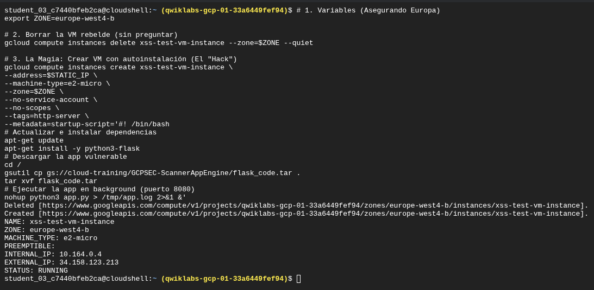
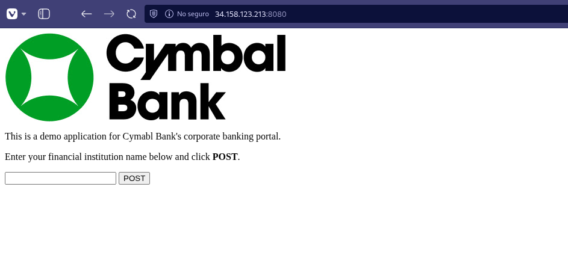
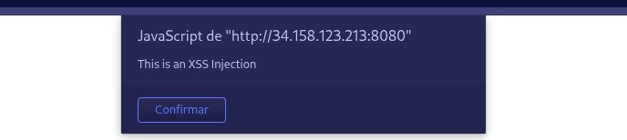
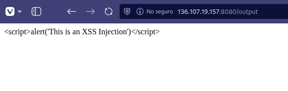
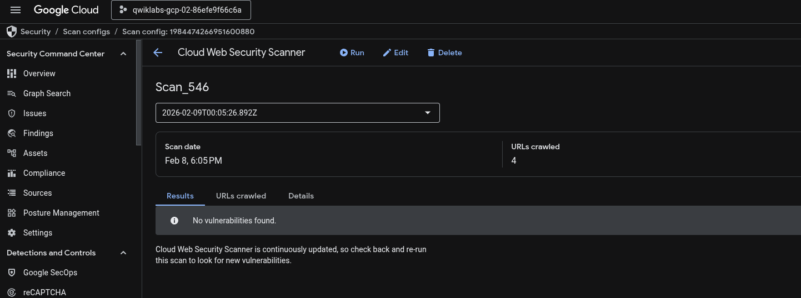
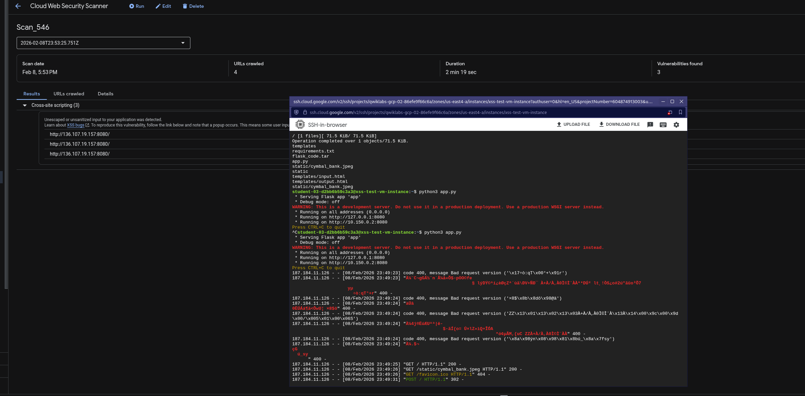

# Reporte Técnico: Identificación de Vulnerabilidades Web (GSP1262)

**Fecha:** 12/02/2026

**Rol:** Application Security Engineer

**Herramienta:** Web Security Scanner (WSS) **Estándar:** OWASP Top 10 (A03:2021 - Injection)

## Contexto del Negocio y Escenario

Como parte de la estrategia **DevSecOps** de Cymbal Bank, se requiere validar la seguridad de los nuevos portales corporativos antes de su paso a producción. El objetivo es implementar pruebas dinámicas de seguridad (DAST) para detectar vulnerabilidades críticas, específicamente inyecciones de código (XSS), que podrían comprometer las sesiones de los usuarios bancarios.

## Objetivos Técnicos

- **Infraestructura:** Desplegar una aplicación web objetivo en Google Compute Engine (Python/Flask).

- **Prueba de Concepto (PoC):** Demostrar la explotabilidad manual de una vulnerabilidad de *Reflected Cross-Site Scripting (XSS)*.

- **Automatización:** Configurar un pipeline de detección utilizando **Web Security Scanner** para descubrimiento continuo.

## Fase 1: Despliegue y Retos de Infraestructura

Se aprovisionó una instancia de Compute Engine (`xss-test-vm-instance`) en la región `europe-west4`, ejecutando una aplicación web vulnerable en el puerto 8080.



### Reto Técnico: Latencia en Aprovisionamiento SSH

Durante el despliegue inicial, se identificó un problema recurrente de saturación de CPU en instancias `e2-micro`, lo que impedía la conexión SSH manual para la configuración del entorno.

**Solución Implementada (Infrastructure as Code):** Se diseñó un **Startup Script** personalizado en Bash para automatizar la configuración al arranque (boot-time).

1. Actualización de repositorios e instalación de `python3-flask`.

2. Descarga y extracción desatendida del código fuente (`flask_code.tar`).

3. Ejecución de la aplicación en segundo plano (`nohup`).

4. **Persistencia para Auditoría:** Inyección de archivos en directorios de usuario (`/home`) para satisfacer los requisitos del agente de auditoría automatizada.

*Evidencia: Portal corporativo de Cymbal Bank desplegado exitosamente y accesible públicamente.*

## Fase 2: Investigación Manual (PoC)

Antes de activar las herramientas automatizadas, se realizó una validación manual para confirmar la superficie de ataque.



**Vector de Ataque:** Se inyectó un payload de JavaScript estándar en el formulario de entrada de la aplicación para probar la sanitización de inputs.

```
<script>alert('This is an XSS Injection')</script>
```





**Resultado:**

El navegador ejecutó el código arbitrario inmediatamente. Esto confirma una vulnerabilidad de tipo **Reflected XSS**, donde la entrada del usuario se devuelve al navegador sin ser escapada o validada.

*Evidencia de explotación: Popup de alerta ejecutándose en el navegador, confirmando ejecución de código arbitrario.*

## Fase 3: Automatización con Web Security Scanner (DAST)

Para escalar la detección a toda la aplicación, se habilitó la API de Web Security Scanner y se configuró un análisis de "Caja Negra" (Blackbox Testing).

*Configuración del servicio de escaneo en el proyecto.*

**Configuración del Escáner:**

- **URL Objetivo:** `http://[IP_PUBLICA]:8080`

- **Agente:** Google Security Scanner

- **Alcance:** Escaneo completo (Crawling + Fuzzing) sin autenticación.
  
  

### Resultados del Análisis

WSS completó el rastreo y detectó exitosamente **3 instancias** de vulnerabilidades XSS en los parámetros del formulario.

- **Hallazgo:** Cross-site scripting (XSS)

- **Severidad:** **Alta**

- **Impacto Potencial:** Robo de cookies de sesión, redirección a sitios de phishing, defacement del sitio.



*Dashboard de WSS confirmando la detección automática y clasificación de las vulnerabilidades.*

## Estrategia de Remediación y Defensa en Profundidad

Para mitigar este riesgo en el código fuente de Cymbal Bank, se proponen las siguientes capas de seguridad:

### 1. Sanitización de Entradas (Context-aware escaping)

Evitar renderizar las entradas como HTML puro. En Python/Flask, se deben utilizar funciones de escape.

**Código Inseguro (Actual):**

```
# La entrada se devuelve tal cual al navegador, permitiendo la ejecución de scripts
return input_string
```

**Código Seguro (Propuesto):**

```
import html
# La entrada se sanitiza, convirtiendo caracteres especiales (<, >) en entidades HTML seguras
return html.escape(input_string)
```

### 2. Content Security Policy (CSP)

Como medida de defensa en profundidad, se recomienda implementar cabeceras HTTP estrictas para restringir las fuentes de scripts ejecutables.

```
Content-Security-Policy: default-src 'self'; script-src 'self' [https://trusted.cdn.com](https://trusted.cdn.com);
```

## Conclusión

Este laboratorio simuló un escenario real de DevSecOps. Se demostró cómo **Web Security Scanner** actúa como una barrera de calidad crítica, permitiendo detectar fallos de inyección antes de que el código llegue a producción. Además, se ejercitaron habilidades de resolución de problemas de infraestructura en la nube mediante automatización de scripts de inicio.
