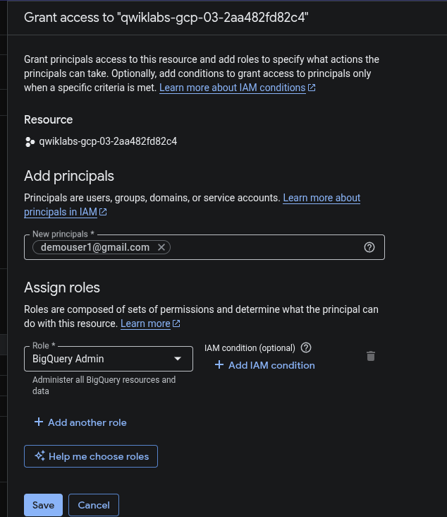
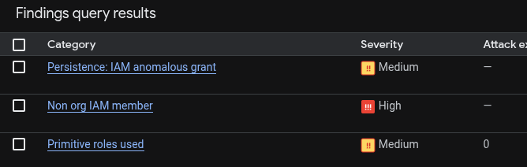
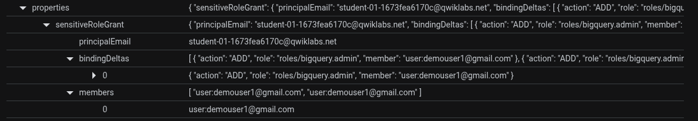
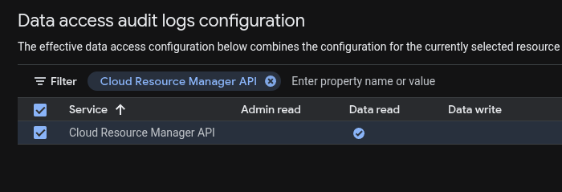
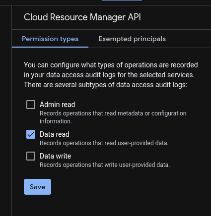
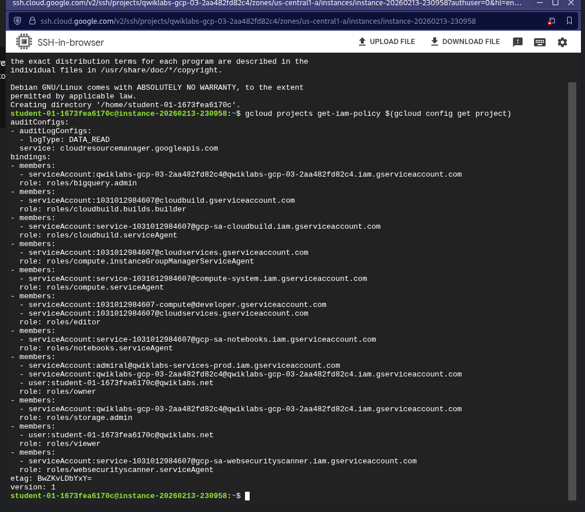
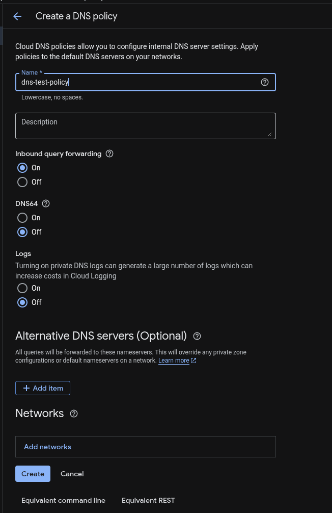
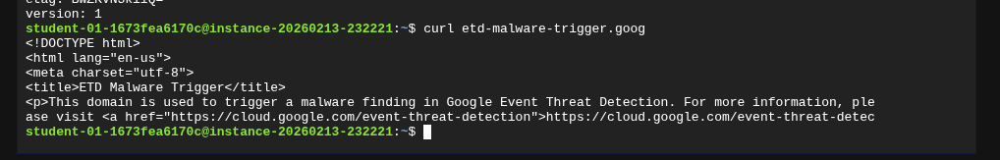
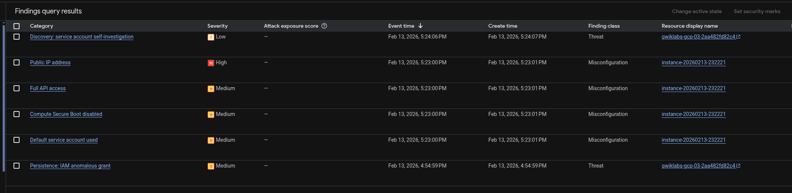

# Reporte Técnico: Detección e Investigación de Amenazas (GSP1125)

**Fecha:** 13/02/2026

**Rol:** Cloud Security Engineer

**Herramienta:** Event Threat Detection (ETD)

**Contexto:** Cymbal Bank - Operaciones de Seguridad (SecOps)

## Contexto del Negocio y Escenario

Cymbal Bank requiere validar la eficacia de **Event Threat Detection (ETD)** para identificar comportamientos maliciosos en tiempo real. El objetivo es simular una cadena de ataque completa (Kill Chain) que incluye persistencia de usuarios externos, reconocimiento de privilegios y comunicación con servidores de comando y control (C2).

## Objetivos de la Simulación

- **Persistencia:** Detectar la concesión de roles privilegiados a identidades no corporativas (Gmail).

- **Reconocimiento:** Identificar cuentas de servicio investigando sus propios permisos (Discovery).

- **Malware:** Detectar tráfico de red saliente hacia dominios maliciosos conocidos.

## Escenario 1: Persistencia y Anomalías de IAM

**Simulación del Ataque:**

Se simuló un compromiso de credenciales donde un atacante otorga el rol de `BigQuery Admin` a una cuenta externa (`demouser1@gmail.com`) para mantener acceso al entorno.

*Acción del atacante: Concesión de privilegios a un usuario externo.*

**Detección:**

SCC correlacionó los logs de IAM y generó alertas críticas inmediatas:

1. **Non org IAM member (High):** Violación de política de restricción de dominios.

2. **Persistence: IAM anomalous grant (Medium):** Patrón de comportamiento de ETD.

*Panel de SCC mostrando las alertas de Persistencia y Miembros fuera de la organización.*

**Análisis Forense:**

Al investigar el hallazgo de persistencia, se identificaron los detalles del actor y el recurso afectado.

*Evidencia detallada del hallazgo de Event Threat Detection.*

## Escenario 2: Reconocimiento (Discovery)

**Configuración de Auditoría:**

Para permitir que ETD analice patrones de reconocimiento, se habilitaron los registros de auditoría de acceso a datos (**Data Access Logs**) para la API de `Cloud Resource Manager`.

*Habilitación de logs ADMIN_READ para la detección de enumeración de privilegios.*

**Simulación del Ataque:**

Un atacante (simulado desde una VM comprometida) ejecutó comandos para enumerar los permisos del proyecto.

*Evidencia de ejecución del comando `get-iam-policy` desde la terminal SSH comprometida.*

**Detección:**

ETD correlacionó esta llamada de API proveniente de una IP interna con el patrón de "Service Account Self-Investigation", confirmando que la identidad de la máquina estaba siendo usada para mapear el entorno.

## Escenario 3: Malware y Exfiltración DNS

**Configuración de Red:**

Se implementó una política de **Cloud DNS** para registrar todas las consultas de nombres, alimentando el motor de inteligencia de amenazas de Google.

*Creación de política de DNS Logging para visibilidad de tráfico saliente.*

**Simulación del Ataque:**

La instancia comprometida intentó resolver y conectar con un dominio marcado como malicioso (`etd-malware-trigger.goog`).

*Intento de conexión (C2 Beaconing) realizado mediante `curl` hacia el dominio indicador de compromiso.*

**Detección:**

SCC generó la alerta **"Malware: Bad Domain"** basada en la resolución DNS, permitiendo al equipo de seguridad aislar la instancia infectada antes de que ocurriera una exfiltración de datos mayor.

## Conclusiones

Este laboratorio demostró la capacidad de **Event Threat Detection** para identificar amenazas que no son simples malas configuraciones, sino comportamientos activos de ataque.

- **Lección Aprendida:** La visibilidad depende de los logs. Sin habilitar *Audit Logs* y *DNS Logging*, ETD es ciego ante ciertos vectores de ataque (como el reconocimiento interno o la salida a dominios C2).

- **Acción:** Se recomienda activar estos logs en todos los proyectos de producción de Cymbal Bank.
