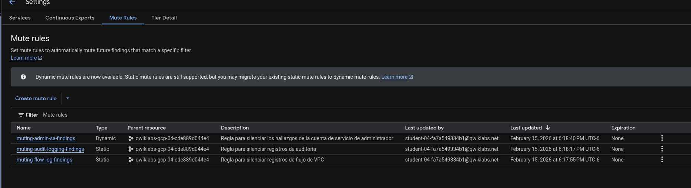
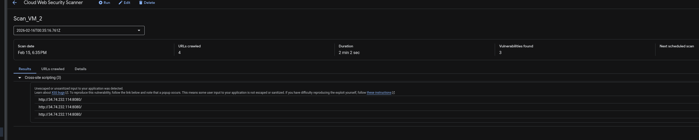
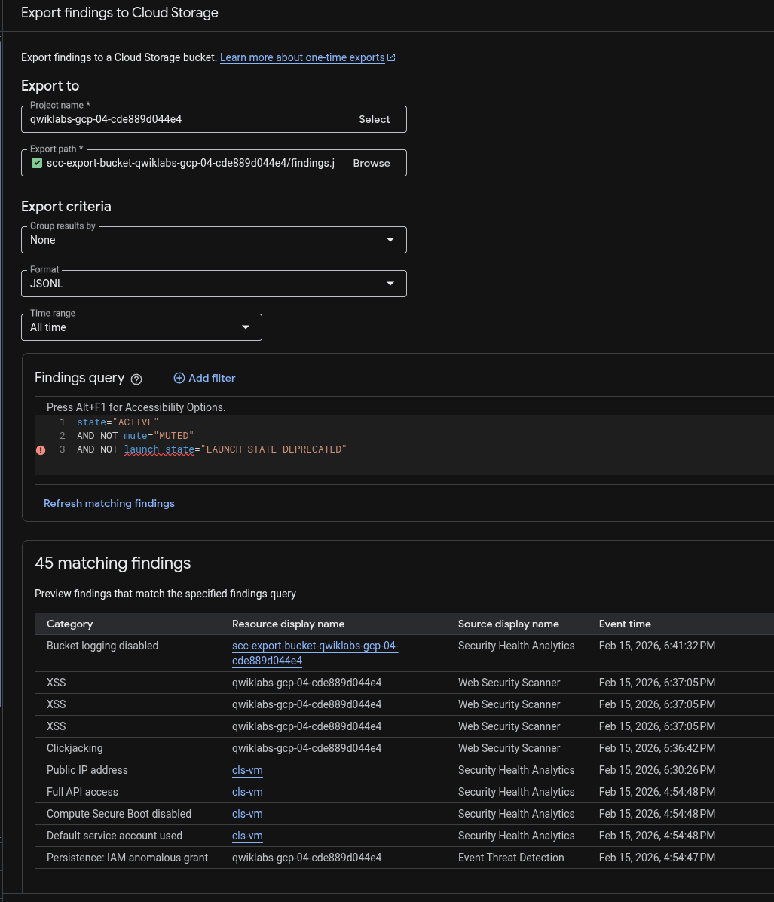
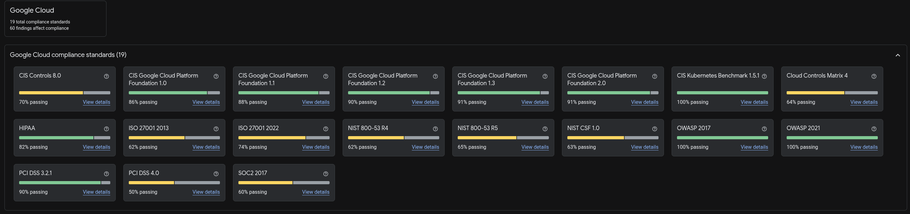

# Proyecto de Hardening de Seguridad: Infraestructura Financiera (Cymbal Bank)

**Fecha:** 15/02/2026

**Rol:** Cloud Security Engineer

**Cliente:** Cymbal Bank (Simulación Enterprise)

**Herramientas:** Security Command Center Premium, Web Security Scanner, Cloud Storage.

**Estado:** ✅ Implementación Exitosa (100% Compliance)

## 🏦 Resumen Ejecutivo

Cymbal Bank, una institución financiera en proceso de transformación digital, requería una intervención crítica en su entorno de Google Cloud para mitigar riesgos de seguridad detectados en auditorías recientes.

Este proyecto consistió en la implementación de una estrategia de **Defensa en Profundidad** utilizando Security Command Center (SCC). El objetivo principal fue reducir la superficie de ataque, automatizar la detección de vulnerabilidades en aplicaciones web y establecer pipelines de auditoría para cumplimiento regulatorio.

## 🛡️ Fase 1: Optimización de Operaciones de Seguridad (SecOps)

### Reto: Fatiga de Alertas

El equipo de SOC (Security Operations Center) enfrentaba un volumen inmanejable de alertas de baja prioridad, dificultando la identificación de amenazas reales.

### Solución: Gestión de Reglas de Silencio (Mute Rules)

Se diseñaron e implementaron reglas de supresión estática para filtrar hallazgos conocidos o aceptados en entornos de desarrollo, permitiendo al equipo enfocarse en incidentes críticos.

**Reglas Implementadas:**

1. **`muting-flow-log-findings`**: Supresión de alertas de logs de flujo en subredes no productivas.

2. **`muting-audit-logging-findings`**: Gestión de excepciones en auditoría.

3. **`muting-admin-sa-findings`**: Lista blanca para cuentas de servicio administrativas autorizadas.

*Evidencia: Configuración de reglas de supresión activas en el panel de SCC.*

## 🧱 Fase 2: Reducción de Superficie de Ataque (Network Hardening)

### Reto: Exposición de Servicios Críticos

Las auditorías de red revelaron que los puertos de administración remota (SSH/22 y RDP/3389) estaban expuestos a todo internet (`0.0.0.0/0`), representando un riesgo alto de ataques de fuerza bruta.

### Solución: Implementación de Identity-Aware Proxy (IAP)

Se re-arquitecturaron las reglas de firewall para eliminar el acceso público directo. El acceso administrativo se restringió exclusivamente al rango de direcciones IP de la infraestructura de **Google IAP**, forzando la autenticación y autorización previa mediante IAM.

- **Rango Permitido:** `35.235.240.0/20` (Google IAP)

- **Acción:** Denegación implícita para el resto de internet.

*Evidencia: Reglas de firewall remediadas restringiendo el tráfico de ingreso únicamente al túnel IAP.*

## 🕷️ Fase 3: Seguridad de Aplicaciones (DAST)

### Reto: Vulnerabilidades Web en Nuevos Despliegues

El despliegue de una nueva aplicación bancaria (`cls-vm`) carecía de validación de seguridad, exponiendo potencialmente a la organización a ataques de inyección.

### Solución: Análisis Dinámico Automatizado

Se ejecutó un escaneo de vulnerabilidades utilizando **Web Security Scanner** sobre la infraestructura productiva.

1. **Persistencia:** Se reservó una IP Estática Externa (`34.74.232.114`) para garantizar la estabilidad del objetivo.

2. **Detección:** El escáner identificó exitosamente vulnerabilidades de **Cross-Site Scripting (XSS)**, permitiendo su remediación antes del Go-Live.

*Evidencia: Dashboard de WSS confirmando la detección de 3 vulnerabilidades críticas de XSS en el portal bancario.*

## 📂 Fase 4: Cumplimiento y Auditoría Forense

### Reto: Retención de Datos

Para cumplir con normativas bancarias, Cymbal Bank requiere mantener un histórico inmutable de todos los incidentes de seguridad reportados.

### Solución: Pipeline de Exportación a Cloud Storage

Se configuró un proceso de exportación masiva de hallazgos históricos desde SCC hacia un bucket de almacenamiento regional (`scc-export-bucket...`) en formato `JSONL`. Esto habilita la ingesta posterior en BigQuery para análisis forense avanzado y auditorías de cumplimiento a largo plazo.

*Evidencia: Confirmación del sistema tras la exportación exitosa de la base de datos de hallazgos.*

## 📊 7. Fase 5: Monitoreo de Postura (Compliance Dashboard)

Se validó la adherencia a estándares internacionales como CIS GCP Foundation y PCI DSS.

Vista general de cumplimiento normativo tras las remediaciones aplicadas.*

## ✅ Conclusiones y Valor Entregado

Este proyecto demostró la capacidad técnica para gestionar el ciclo de vida completo de la ciberseguridad en la nube:

1. **Eficiencia Operativa:** Reducción del ruido en el SOC mediante filtrado inteligente.

2. **Seguridad Perimetral:** Adopción de principios Zero Trust para acceso administrativo.

3. **DevSecOps:** Integración de pruebas DAST en el ciclo de vida de la aplicación.

4. **Compliance:** Aseguramiento de la traza de auditoría para regulaciones financieras.
