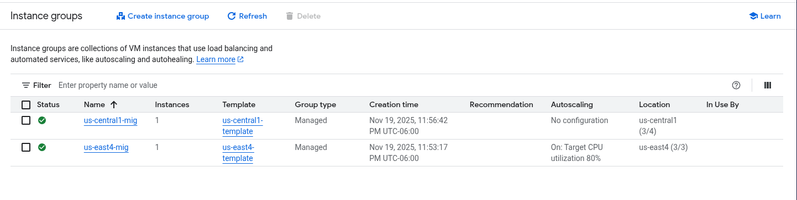

# 🛡️ Reporte Técnico: Implementación de Balanceo de Carga Global y Seguridad Perimetral (Cloud Armor)

Autor: Christhian Rodríguez

Fecha: 20 de Noviembre de 2025

Laboratorio: GSP215 - Google Cloud Skills Boost

Tecnologías: Google Compute Engine, Cloud Load Balancing, Cloud Armor, Bash/CLI.

## 1. 🌐 Introducción y Arquitectura

### 🎯 Objetivo del Proyecto

El objetivo principal fue diseñar una arquitectura de alta disponibilidad capaz de resistir fallos regionales y ataques de denegación de servicio (DDoS). Se implementó un **External Application Load Balancer (ALB)** para distribuir tráfico HTTP globalmente y se aseguró el perímetro utilizando **Google Cloud Armor**.

### 🏗️ Topología de Red

La arquitectura sigue un modelo de "defensa en profundidad":

1. **Usuario/Cliente:** Solicita acceso vía Internet.

2. **Cloud Load Balancing (Anycast IP):** Recibe la solicitud en el punto de presencia (PoP) más cercano al usuario.

3. **Cloud Armor:** Analiza la solicitud en el borde (Edge) antes de que entre a la red VPC.

4. **Backend Services:** Distribuye la carga entre regiones (Iowa y Virginia).

> **Diagrama de Arquitectura Implementada:**
> 
> 

## 2. 🔥 Seguridad de Red (Firewall Rules)

Para que el balanceador funcione, es necesario abrir puertos específicos. Google Cloud bloquea todo el tráfico entrante por defecto.

### 📸 Evidencia de Configuración


### 🧠 Análisis Técnico: ¿Por qué estas reglas?

1. **Acceso HTTP (`default-allow-http`):**
   
   - **Rango:** `0.0.0.0/0` (Cualquier IP del mundo).
   
   - **Puerto:** `80` (Estándar web no cifrado).
   
   - **Función:** Permite que los usuarios legítimos vean la página web.

2. **Health Checks (`default-allow-health-check`):** ⚠️ *Crítico*
   
   - **Rangos:** `130.211.0.0/22` y `35.191.0.0/16`.
   
   - **¿Qué son estas IPs?**: Son rangos de direcciones IP propiedad de Google. Los sistemas de balanceo de carga usan estas IPs para enviar señales ("pings") a tus servidores y verificar si están vivos.
   
   - **Consecuencia de no tenerla:** Si bloqueas estas IPs, el balanceador creerá que todos tus servidores están caídos y dejará de enviar tráfico (Error 502).

### 💻 Implementación vía CLI (gcloud)

```
# Regla para permitir tráfico Web
gcloud compute firewall-rules create default-allow-http \
    --action=ALLOW \
    --direction=INGRESS \
    --rules=tcp:80 \
    --source-ranges=0.0.0.0/0 \
    --target-tags=http-server

# Regla para permitir sondas de salud (Health Checks)
gcloud compute firewall-rules create default-allow-health-check \
    --action=ALLOW \
    --direction=INGRESS \
    --rules=tcp \
    --source-ranges=130.211.0.0/22,35.191.0.0/16 \
    --target-tags=http-server
```

- `--target-tags=http-server`: Aplica la regla solo a las VMs que tengan esta etiqueta, no a toda la red (Principio de menor privilegio).

## 3. ☁️ Infraestructura de Cómputo (Compute Engine)

Desplegamos servidores en dos regiones geográficas para garantizar redundancia.

### 📸 Evidencia de Despliegue

Grupos de Instancias (MIGs):



Instancias VM Activas:


### 🧠 Análisis Técnico

1. **Instance Templates (Plantillas):**
   
   - Definen el "molde" de la máquina virtual (`e2-micro`, imagen Debian).
   
   - Incluyen un **Startup Script**: Un script que se ejecuta automáticamente al encender la máquina para instalar Apache (`apt-get install apache2`). Sin esto, tendríamos servidores vacíos.

2. **Managed Instance Groups (MIGs):**
   
   - Agrupan VMs idénticas. Permiten **Autoscaling** (crecer si la CPU sube) y **Autohealing** (reemplazar una VM si falla el health check).
   
   - **Nota de Resolución de Problemas:** Durante el laboratorio, se identificó que la *región* del Grupo debe coincidir con la *subred* definida en la plantilla.

### 💻 Implementación vía CLI

```
# Crear la plantilla (Template) en Iowa
gcloud compute instance-templates create us-central1-template \
    --region=us-central1 \
    --tags=http-server \
    --metadata=startup-script-url=gs://spls/gsp215/gcpnet/httplb/startup.sh

# Crear el Grupo de Instancias (MIG)
gcloud compute instance-groups managed create us-central1-mig \
    --base-instance-name=us-central1-mig \
    --template=us-central1-template \
    --size=1 \
    --region=us-central1
```

## 4. ⚖️ Balanceador de Cargas de Aplicaciones (ALB)

El componente central que orquesta el tráfico global.

### 📸 Evidencia de Configuración


### 🧠 Análisis Técnico: Estrategias de Balanceo

Se configuraron dos estrategias diferentes para demostrar la flexibilidad del ALB:

1. **Región `us-central1` (Iowa) → Modo RATE (Tasa):**
   
   - Configurado a **50 RPS** (Requests Per Second).
   
   - *Uso:* Ideal para APIs o bases de datos que tienen un límite duro de transacciones por segundo, independientemente de la CPU.

2. **Región `us-east4` (Virginia) → Modo UTILIZATION (Utilización):**
   
   - Configurado al **80%**.
   
   - *Uso:* Ideal para aplicaciones web tradicionales donde el cuello de botella es el procesamiento (CPU).

**Frontend:** Se habilitó **IPv6**. Esto es crucial en redes modernas, ya que muchos dispositivos móviles operan nativamente en IPv6. Si no se configura, se pierde visibilidad de ese tráfico.

## 5. 📉 Pruebas de Estrés (Siege)

Para validar la configuración, simulamos un ataque de tráfico masivo.

### 📸 Evidencia del Ataque


### 🧠 Análisis del Comando Siege

Utilizamos la herramienta `siege` desde una VM externa.

```
siege -c 150 -t120s http://$LB_IP
```

- `siege`: La herramienta de benchmarking.

- `-c 150`: **Concurrency**. Simula 150 usuarios golpeando el sitio *al mismo tiempo exacto*.

- `-t120s`: **Time**. Mantiene el ataque durante 2 minutos.

**Observación:** En la gráfica (lado derecho de la imagen) se observa el fenómeno de **"Spillover"** (desbordamiento). El tráfico llega primero a la región más cercana, satura la capacidad configurada (los 50 RPS o el 80% CPU) y el balanceador inteligentemente desvía el exceso a la siguiente región disponible.

## 6. 🛡️ Defensa Perimetral (Cloud Armor)

Tras identificar la IP maliciosa en los logs, implementamos una defensa activa.

### 📸 Evidencia de Política Activa


### 🧠 Análisis Técnico: ¿Por qué Cloud Armor?

Cloud Armor es un WAF (Web Application Firewall) que reside en el **borde (edge)** de la red de Google.

- **Sin Cloud Armor:** El tráfico malicioso llega hasta tus servidores (VMs). Aunque el firewall interno lo bloquee, la VM ya gastó recursos procesando la conexión inicial.

- **Con Cloud Armor:** El tráfico es detenido en la red global de Google, lejos de tus servidores. Esto protege tu infraestructura de saturación volumétrica.

### 💻 Implementación vía CLI

```
# 1. Crear la política de seguridad
gcloud compute security-policies create denylist-siege \
    --description "Bloqueo de IP atacante Siege"

# 2. Agregar la regla de bloqueo (Deny 403)
gcloud compute security-policies rules create 1000 \
    --security-policy=denylist-siege \
    --action=deny-403 \
    --src-ip-ranges=34.12.151.200 \
    --description="Bloquear atacante conocido"

# 3. Vincular la política al Backend (Paso final)
gcloud compute backend-services update http-backend \
    --security-policy=denylist-siege \
    --global
```

**Explicación de parámetros clave:**

- **`deny-403`**: Devuelve un error "Forbidden" (Prohibido) al atacante, rechazando la conexión inmediatamente.

- **`priority 1000`**: Las reglas de firewall y seguridad se evalúan por número. Un número **menor** tiene **mayor prioridad** (se ejecuta antes). Por ejemplo, una regla 1000 le gana a una regla 65000.

---

## ✅ Conclusiones Finales

Este laboratorio demostró con éxito cómo desplegar una aplicación web resiliente a escala global.

1. **Alta Disponibilidad:** Lograda mediante MIGs distribuidos regionalmente.

2. **Eficiencia:** El balanceador distribuye el tráfico basándose en métricas precisas (RPS vs CPU).

3. **Seguridad:** Se protegió la infraestructura no solo con firewalls tradicionales (puertos), sino con seguridad inteligente en el borde (Cloud Armor) basada en reputación de IPs.
