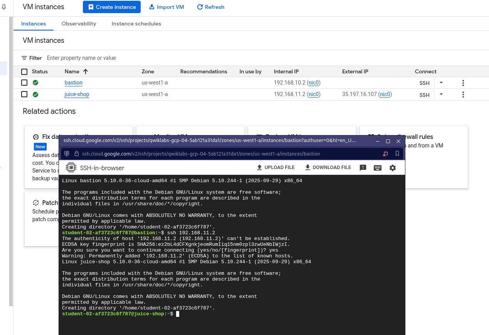

# 🛡️ Caso de Estudio: Arquitectura de Red Segura y Modelo Zero Trust en Google Cloud

**Consultor:** Christhian Alberto Rodríguez García

**Fecha:** Noviembre 2025

**Tecnologías:** Google Cloud Platform (GCP), VPC, Firewall, Identity-Aware Proxy (IAP), Compute Engine.

**Certificación Obtenida:** Build a Secure Google Cloud Network Skill Badge.

## 1. Resumen Ejecutivo

En este proyecto, asumí el rol de Consultor de Seguridad para "Juice Shop", una empresa emergente cuya infraestructura en la nube presentaba vulnerabilidades críticas debido a una configuración inicial insegura.

El objetivo fue rediseñar la arquitectura de seguridad perimetral e interna implementando un modelo de **Defensa en Profundidad**. Se logró eliminar la exposición de puertos de administración a internet pública, implementando accesos verificados por identidad (IAP) y segmentación de red interna, todo esto sin interrumpir el servicio web público.

## 2. El Desafío: Situación Inicial

La auditoría inicial de la infraestructura reveló graves fallos de seguridad (Antipatrones):

- **Reglas permisivas:** Existían reglas de firewall (`open-access`) que permitían tráfico desde `0.0.0.0/0` a todos los puertos.

- **Superficie de ataque expuesta:** Los servidores de administración (Bastion) y de aplicaciones tenían IPs públicas expuestas con puertos SSH abiertos, vulnerables a ataques de fuerza bruta.

- **Falta de segmentación:** No existía control de tráfico entre las subredes internas.

## 3. Estrategia de Solución: Arquitectura Zero Trust

Para mitigar estos riesgos, diseñé una solución basada en tres pilares fundamentales de ciberseguridad:

1. **Principio de Mínimo Privilegio (PoLP):** Solo permitir el tráfico estrictamente necesario.

2. **Identity-Aware Proxy (IAP):** Reemplazar el acceso SSH tradicional por túneles TCP encapsulados en HTTPS, autenticados por Google IAM.

3. **Micro-segmentación con Etiquetas:** Uso de *Network Tags* para aplicar reglas de firewall granulares a instancias específicas, no a toda la red.

## 4. Implementación Técnica

## Esquema

### Fase 1: Hardening (Endurecimiento de la Red)

El primer paso crítico fue la eliminación de la deuda técnica de seguridad. Se identificaron y eliminaron las reglas de firewall heredadas que permitían el acceso irrestricto. Esto colocó a la red en un estado de "Denegación por defecto".

*Fig 1. Panel de Firewall tras la limpieza. Se eliminaron reglas peligrosas y se observa una configuración limpia y específica.*

### Fase 2: Acceso Administrativo Seguro (Bastion Host + IAP)

En lugar de asignar una IP pública al servidor Bastion, configuré el acceso exclusivamente a través del **Identity-Aware Proxy**.

- **Configuración:** Se creó una regla de firewall permitiendo tráfico al puerto 22 **únicamente** desde el rango de IP de infraestructura de Google: `35.235.240.0/20`

- **Resultado:** El servidor es invisible para los escáneres de puertos en internet, pero accesible para los administradores autenticados.

### Fase 3: Publicación Segura de Aplicaciones

Para el servidor web `juice-shop`, se habilitó el tráfico HTTP (Puerto 80) desde internet (`0.0.0.0/0`). Sin embargo, para evitar movimientos laterales, esta regla se asoció estrictamente a la etiqueta de red de la instancia web.

*Fig 2. Detalle de la instancia 'juice-shop'. Se observan las etiquetas de red (Network Tags) que vinculan la instancia con las reglas de firewall específicas, aislando su función.*

### Fase 4: Segmentación de Tráfico Interno

El servidor de aplicaciones no debe recibir conexiones SSH desde internet. Su administración se restringió exclusivamente al tráfico proveniente de la subred de gestión donde reside el Bastion Host.

Análisis de Subred:

Se identificó el rango CIDR de la subred de gestión (acme-mgmt-subnet) para crear una regla de ingreso precisa.

*Fig 3. Identificación del rango de IP interno (192.168.10.0/24) para permitir el tráfico seguro entre el Bastion y la Aplicación.*

## 5. Validación y Pruebas de Conectividad

Para certificar la seguridad de la arquitectura, se realizó una prueba de conexión de "doble salto" (Double-hop SSH).

**Flujo de la prueba:**

1. Conexión desde mi estación de trabajo local hacia el **Bastion** mediante el túnel IAP (autenticado por IAM).

2. Conexión SSH interna desde el Bastion hacia la IP privada de **Juice Shop** (`192.168.11.2`).

*Fig 4. Evidencia de la terminal ("Money Shot"). Muestra la conexión exitosa al Bastion y el posterior salto a la instancia interna 'juice-shop' utilizando direcciones IP privadas, confirmando el aislamiento de la red.*

## 6. Conclusión

La implementación fue exitosa, logrando una arquitectura de 3 capas segura y funcional. La superficie de ataque se redujo drásticamente al eliminar puntos de entrada públicos innecesarios.

**Habilidades Demostradas:**

- ✅ Configuración avanzada de VPC Firewall Rules.

- ✅ Implementación de Seguridad Zero Trust con Google IAP.

- ✅ Gestión de Compute Engine y Network Tags.

- ✅ Troubleshooting de conectividad de red.

---
