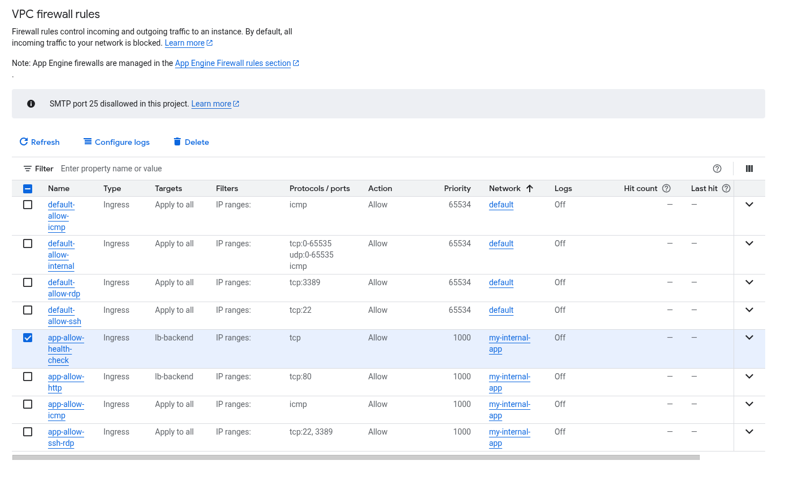
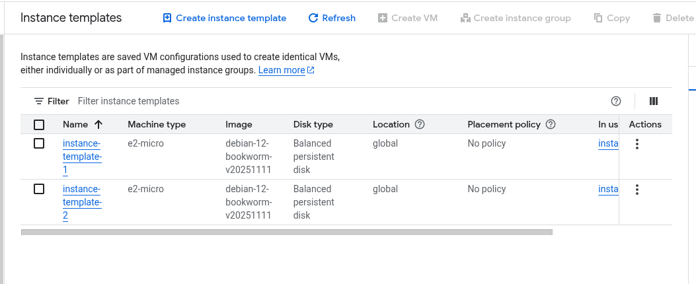

# Reporte de Laboratorio: Balanceo de Cargas Interno en Google Cloud

**Laboratorio:** GSP216 - Internal Load Balancing

**Fecha:** 20 de Noviembre de 2025

**Estado:** Completado (100/100)

## 1. Resumen Ejecutivo

En este laboratorio se diseñó e implementó una arquitectura de **Alta Disponibilidad** utilizando un **Balanceador de Cargas de Red de Transferencia Interno (Internal Passthrough Network Load Balancer)**. El objetivo fue distribuir el tráfico TCP de manera eficiente entre instancias de máquinas virtuales (VMs) ubicadas en una red privada, asegurando que la aplicación sea resiliente ante fallos zonales y escalable.

## 2. Marco Teórico: ¿Para qué sirve esto?

El Balanceo de Cargas Interno (ILB) es fundamental en arquitecturas de nube modernas por las siguientes razones:

- **Seguridad:** Permite que los servicios se comuniquen entre sí (ej. Frontend hablando con Backend, o Backend con Base de Datos) usando direcciones IP privadas (RFC 1918), sin exponerse jamás a Internet público.

- **Alta Disponibilidad:** Si una zona de Google Cloud falla, el balanceador redirige el tráfico automáticamente a las instancias sanas en otra zona.

- **Escalabilidad:** Permite añadir o quitar servidores automáticamente según la demanda sin cambiar la dirección IP a la que apuntan los clientes.

**Casos de Uso Reales:**

1. **Arquitectura de 3 Capas:** Comunicación entre la capa web y la capa de aplicación.

2. **Microservicios:** Distribución de tráfico entre cientos de microcontenedores internos.

3. **Sistemas Legacy:** Aplicaciones que requieren protocolos TCP/UDP tradicionales dentro de una intranet corporativa.

## 3. Implementación Paso a Paso

## Esquema de infraestructura

### Paso 1: Configuración de Seguridad (Firewall)

La base de la seguridad en la VPC `my-internal-app` consistió en crear reglas de firewall restrictivas. Se configuraron dos reglas críticas:

1. `app-allow-http`: Permite tráfico TCP puerto 80 desde la subred interna (`10.10.0.0/16`).

2. `app-allow-health-check`: Permite que los sistemas de Google verifiquen si las instancias están vivas. **Crucial:** Se habilitaron los rangos `130.211.0.0/22` y `35.191.0.0/16`.

> **Evidencia de Configuración:** Se observan las reglas creadas apuntando al target tag `lb-backend`.

(Imagen: Lista general de reglas de firewall mostrando app-allow-http y health-check)

### Paso 2: Estandarización con Plantillas de Instancia

Para garantizar que todos los servidores sean idénticos (idempotencia), se crearon **Plantillas de Instancia (Instance Templates)**. Estas plantillas definen:

- Sistema Operativo (Debian).

- Script de inicio (Instalación automática de Apache).

- Etiquetas de red (`lb-backend`) para aplicar los firewalls.

(Imagen: Lista de Instance Templates 1 y 2)

### Paso 3: Despliegue de Grupos de Instancias Administrados (MIGs)

Se crearon dos **Managed Instance Groups (MIGs)** regionales.

- `instance-group-1` en la zona `us-west1-a`.

- instance-group-2 en la zona us-west1-a (Nota: Para HA real, idealmente deberían estar en zonas distintas como a y b).
  
  Estos grupos gestionan el ciclo de vida de las VMs y permiten el autoescalado.

(Imagen: Panel de Instance Groups)

### Paso 4: Configuración del Balanceador de Cargas (ILB)

Se configuró el recurso `my-ilb` con:

- **Frontend:** IP interna estática `10.10.30.5`.

- **Backend:** Los dos grupos de instancias creados anteriormente.

- **Health Check:** Sondeo TCP puerto 80.

(Imagen: Panel de Load Balancing mostrando my-ilb)

## 4. Análisis de Resultados y Troubleshooting (Lecciones Aprendidas)

Durante la fase de verificación, se obtuvo una puntuación de **100/100** en la plataforma, lo que indica que todos los recursos de infraestructura fueron creados con los nombres y configuraciones base correctos.

Sin embargo, se detectó un problema de conectividad técnica durante las pruebas de `curl`, donde el tráfico no fluía hacia los backends.

Diagnóstico del Problema:

Al revisar el detalle de las instancias creadas (ver imagen abajo), se observó lo siguiente:

- **Red Esperada:** `my-internal-app` (Rango `10.10.x.x`).

- **Red Actual:** `default` (Rango `10.138.x.x`).

(Imagen: Lista de VMs mostrando las IPs 10.138.x.x)

Causa Raíz:

Al configurar la Plantilla de Instancia, la interfaz de red se dejó en default en lugar de cambiarse a la VPC personalizada my-internal-app.

Impacto:

El Balanceador de Cargas (que vive en la red my-internal-app) intentaba enviar tráfico a instancias que residían en una red totalmente aislada (default), haciendo imposible la comunicación sin un VPC Peering. Esto causó que los Health Checks fallaran y el tráfico se bloqueara, aunque la configuración lógica del balanceador fuera correcta.

Solución Correctiva (Post-Laboratorio):

Para corregir esto en un entorno real, se requiere:

1. Eliminar los Grupos de Instancias actuales.

2. Crear una nueva Plantilla de Instancia asegurando seleccionar la red `my-internal-app`.

3. Recrear los grupos con la nueva plantilla.

## 5. Conclusión

Este laboratorio demostró exitosamente los pasos para configurar un entorno de balanceo de carga interno en Google Cloud. Se reforzaron conceptos críticos sobre la importancia de la **alineación de redes (VPCs)** y el uso correcto de **Etiquetas de Red (Tags)** para la seguridad. El incidente de conectividad sirvió como un excelente caso de estudio para comprender el aislamiento de redes en la nube pública.
