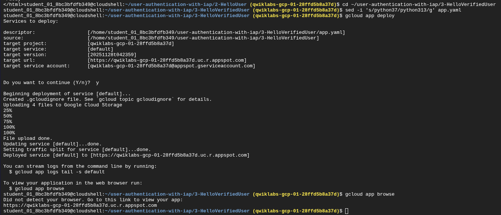

# 🛡️ Reporte de Laboratorio: Autenticación de Usuarios con Identity-Aware Proxy (IAP)

**Laboratorio:** GSP499 - User Authentication: Identity-Aware Proxy

**Plataforma:** Google Cloud Platform (GCP)

**Tecnología Principal:** App Engine, IAM, IAP (Zero Trust Security)

**Autor:** Christhian Rodriguez

## 1. Introducción y Objetivo

El objetivo de este laboratorio fue transformar una aplicación web pública y sin seguridad en una aplicación interna segura utilizando el modelo **"Zero Trust"** (Cero Confianza) de Google.

En lugar de utilizar firewalls tradicionales o VPNs complejas, implementamos **Identity-Aware Proxy (IAP)**. IAP actúa como un "guardia de seguridad" inteligente que intercepta todas las solicitudes web, verifica la identidad del usuario contra Google Identity Services y solo permite el paso si el usuario tiene los permisos IAM correctos.

### ¿Qué es realmente IAP?

IAP es un servicio global de GCP que permite controlar el acceso a aplicaciones HTTPs (en App Engine, Compute Engine o Kubernetes) basándose en la **identidad** del usuario y el **contexto** de la solicitud, no solo en su dirección IP de red. Es la base del modelo *BeyondCorp* de Google, permitiendo a los empleados trabajar desde cualquier lugar sin VPN.

## 2. Desarrollo del Laboratorio

### Fase 1: Despliegue Inicial de la Aplicación

Comenzamos desplegando una aplicación básica en Python ("Hello World") en **Google App Engine Standard Environment**.

**Comandos Clave:**

- `sed -i 's/python37/python313/g' app.yaml`: Actualizamos la configuración para usar una versión moderna de Python (3.13).

- `gcloud app deploy`: Empaqueta el código y lo sube a la infraestructura de Google.

> Evidencia de Despliegue:
> 
> Aquí se muestra la terminal confirmando que la aplicación se subió correctamente a App Engine y la URL pública generada.
> 
> 

> Estado Inicial:
> 
> La aplicación es accesible públicamente por cualquier persona en internet. No hay seguridad.
> 
> 

### Fase 2: Restricción de Acceso con IAP

Para proteger la aplicación, configuramos la **Pantalla de Consentimiento OAuth** (necesaria para que IAP pueda "loguear" usuarios) y activamos el interruptor de IAP.

> Configuración OAuth:
> 
> Se creó la configuración básica interna para permitir la autenticación.
> 
> 

Activación de IAP:

> En la consola de Seguridad, encendimos IAP para el recurso de App Engine. En este punto, el tráfico se corta para todos.
> 
> La Prueba de Fuego:
> 
> 
> 
> Al intentar acceder a la web nuevamente, el acceso fue denegado. Esto confirma que IAP está interceptando el tráfico. Aunque me autentiqué con Google, mi usuario no tenía permiso para pasar.

> Acceso Denegado:
> 
> IAP bloquea la solicitud porque mi usuario no está autorizado explícitamente.
> 
> 

Resolución:

Agregamos al usuario estudiante al rol IAM IAP-secured Web App User.

> Gestión de IAM:
> 
> Asignación del rol específico que permite "atravesar" el proxy de identidad.
> 
> 

### Fase 3: Identidad del Usuario y Vulnerabilidades

Actualizamos la aplicación para que leyera los encabezados (headers) que IAP inyecta en la petición (`X-Goog-Authenticated-User-Email`).

Sin embargo, descubrimos un riesgo: **Si IAP se apaga accidentalmente, cualquiera puede falsificar esos encabezados.**

Realizamos un ataque de "Spoofing" simulado usando `curl` mientras IAP estaba apagado.

> Simulación de Ataque:
> 
> Usando curl, inyecté un header falso (totally fake email). Como la app confiaba ciegamente en el header sin verificar la firma, creyó que ese era mi usuario.
> 
> 

### Fase 4: Verificación Criptográfica (Solución Robusta)

Para solucionar la vulnerabilidad anterior, implementamos una validación del header `X-Goog-IAP-JWT-Assertion`. Este es un token firmado criptográficamente por Google.

La aplicación ahora:

1. Recibe el token.

2. Descarga las claves públicas de Google.

3. Verifica que el token sea auténtico y no haya sido alterado.

> Despliegue Final:
> 
> Subiendo la versión segura del código (3-HelloVerifiedUser) que incluye las librerías de validación criptográfica.
> 
> 

Resultado Final:

Con IAP activado nuevamente y el código seguro, la aplicación muestra la identidad real y verificada. Ya no es posible engañarla con un simple curl.

> Usuario Verificado:
> 
> La aplicación muestra los datos extraídos del JWT verificado. Seguridad completa.
> 
> 

> Consola IAP Final:
> 
> Estado final del servicio protegiendo el recurso.
> 
> 

## 3. Lecciones Aprendidas y Conclusiones

1. **Seguridad Perimetral:** IAP simplifica drásticamente la seguridad. No tuvimos que configurar firewalls complejos ni VPNs para restringir el acceso a usuarios corporativos internos.

2. **Defensa en Profundidad:** No basta con confiar en que IAP está encendido. La aplicación debe ser responsable de verificar la autenticidad de la información que recibe (validación JWT).

3. **Roles IAM:** La seguridad en GCP es granular. Un usuario autenticado no es sinónimo de autorizado; se requiere el rol específico `IAP-secured Web App User`.

### Glosario de Comandos Utilizados

| **Comando**                  | **Descripción**                                                                                               |
| ---------------------------- | ------------------------------------------------------------------------------------------------------------- |
| `gcloud auth list`           | Muestra la cuenta activa y las credenciales actuales.                                                         |
| `gcloud config list project` | Verifica en qué proyecto de GCP estamos trabajando.                                                           |
| `gcloud app deploy`          | Despliega el código local a App Engine.                                                                       |
| `gcloud app browse`          | Abre la URL de la aplicación desplegada en el navegador.                                                      |
| `curl -X GET -H "..."`       | Herramienta para hacer peticiones HTTP manuales; usada aquí para simular un ataque inyectando headers falsos. |
